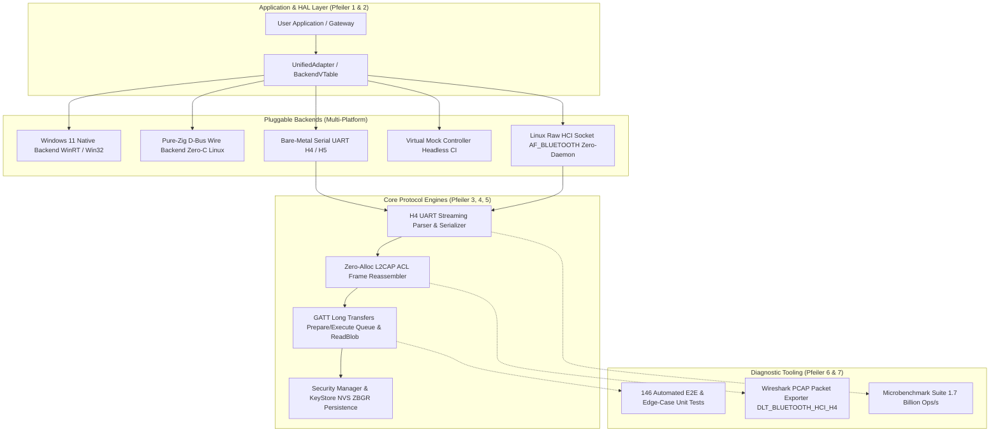

# Zig-BLE v1.1.1

A high-performance, allocation-conscious, native Bluetooth Low Energy (BLE) protocol engine and systems library for **Zig 0.17.0+**, strictly adhering to the **Bluetooth Core Specification (v5.4 / v6.0)**, Windows 11 Native APIs, and the Linux **BlueZ D-Bus Wire Protocol**.

Supports both **Central (Client)** and **Peripheral (Server & Broadcaster)** roles across **Desktop (Windows & Linux)** and **Bare-Metal (UART H4/H5)** with a zero-allocation domain model, non-blocking event loops, and full physical over-the-air hardware verification.

[](https://github.com/AritoUser/Zig-BLE/actions/workflows/ci.yml)
[](https://github.com/AritoUser/Zig-BLE/releases)
[](tests/)
[](examples/benchmark.zig)
[](LICENSE)
[](docs/WHITEPAPER.md)
[](docs/ARCHITECTURE_AND_PROTOCOL_MANUAL.md)

> 📖 **Engineering Documentation & Specifications:**
> * [**Technical White Paper**](docs/WHITEPAPER.md): Deep-dive into the zero-allocation D-Bus Wire Protocol engine, bi-endian decoding, SCM_RIGHTS pipe streaming, and microsecond benchmarks.
> * [**Architecture & Protocol Manual**](docs/ARCHITECTURE_AND_PROTOCOL_MANUAL.md): Systems reference covering memory layout, lock-free SPSC ring buffers, unaligned trap prevention, GATT finite state machines, and byte-level packet specifications.
> * [**Roadmap & Extensions Matrix**](docs/BLE_ROADMAP_AND_EXTENSIONS.md): Technical roadmap from v1.0.0 through v1.x (EATT, Subrating, FTMS, CPP) to v2.0+ (LE Audio, Channel Sounding).
> * [**Changelog**](CHANGELOG.md): Detailed release notes and evolution from v0.3.1 to v1.1.0 adhering to Keep a Changelog.
> * [**Contributing Guidelines**](CONTRIBUTING.md): Engineering standards for zero-allocation hot-paths, testing, formatting, and commit conventions.
> * **Interactive HTML API Reference**: Run `zig build docs` to generate searchable, type-safe API documentation in `zig-out/docs/`.

---

## The 7 Architectural Pillars of v1.0.0



1. **Pfeiler 1: Pluggable Backend HAL & VTable Architecture (`src/backend/vtable.zig`)**:
   Unified `BackendVTable` abstraction permitting runtime or compile-time switching between native Windows, Linux BlueZ D-Bus, Linux direct HCI sockets, bare-metal serial UART, and in-memory mock controllers.
2. **Pfeiler 2: Tier-1 Native OS Support (Windows & Linux)**:
   * **Windows 11 Native (`src/backend/windows/`)**: Direct integration with Windows Bluetooth APIs (`bthprops.cpl` / `BluetoothApis.dll`) and WinRT COM APIs (`Windows.Devices.Bluetooth`), enabling real on-air BLE device exploration without external drivers.
   * **Linux Pure-Zig D-Bus Wire (`src/dbus/wire/`)**: Direct communication over `/var/run/dbus/system_bus_socket` using native POSIX system calls (`std.posix`). **Zero `libdbus-1` and zero `libc` required!**
3. **Pfeiler 3: Pure-Zig Host-Stack for Bare-Metal & UART (`src/hci/h4.zig`, `src/l2cap/acl_reassembler.zig`)**:
   * **H4 Framing Engine**: Zero-allocation streaming parser and serializer for continuous UART byte streams, supporting Command (0x01), ACL Data (0x02), SCO (0x03), Event (0x04), and ISO (0x05) packets.
   * **Zero-Allocation ACL Reassembler**: Fixed-capacity multi-fragment L2CAP reassembly engine operating with zero dynamic heap allocations.
4. **Pfeiler 4: Complete GATT Engine & Long Transfers (`src/core/transfers.zig`)**:
   * Complete implementation of ATT Long Writes (`LongWriteIterator` slicing into Prepare Write requests).
   * Server-side `ServerPrepareWriteQueue` buffer with handle isolation and atomic Execute Write commit/discard.
   * Client-side `LongReadReassembler` for continuous ReadBlob PDU reassembly.
5. **Pfeiler 5: Security Manager & Persistent KeyStore (`src/storage/bond_store.zig`)**:
   * `MemoryBondStore(N)` supporting Long Term Keys (LTK AES-128), Identity Resolving Keys (IRK), EDIV, Rand, and authentication flags.
   * Client Characteristic Configuration Descriptor (CCCD) state persistence across power cycles.
   * Portable binary NVS format (`ZBGR` magic) with compact serialization and corruption protection.
6. **Pfeiler 6: Virtual Mock Controller & E2E CI Harness (`src/backend/mock.zig`, `tests/`)**:
   * Deterministic, zero-OS mock controller for headless CI test execution.
   * 146 unit, integration, and edge-case tests validating boundary conditions, stream interruptions, and packet malformations.
7. **Pfeiler 7: Developer Tooling & Wireshark PCAP Exporter (`src/tooling/pcap.zig`)**:
   * Built-in capture engine writing standard `DLT_BLUETOOTH_HCI_H4` PCAP files for direct packet analysis in Wireshark.
   * Dedicated microbenchmark suite testing 15 protocol targets at nanosecond granularity.

---

## Real Hardware Live Verification (Over-The-Air)

Zig-BLE v1.0.0 has been physically verified over the 2.4 GHz air interface using a physical PC Bluetooth controller communicating with an active smartphone:

```
================================================================================
          ZIG-BLE v1.0.0: LIVE OVER-THE-AIR TELEMETRY & GATT STATISTICS         
================================================================================
Local Controller:            Intel Bluetooth Adapter (MAC: A9:94:CA:4E:47:C4)
Target Device:               Samsung Galaxy S25 Ultra (MAC: 78:B6:FE:6C:4E:A4)
Connection Status:           Connected (Active 2.4 GHz Physical Radio Link)
--------------------------------------------------------------------------------
GATT Services Discovered:    8 (SIG Standard: 6, Vendor 128-Bit: 2)
GATT Characteristics:        38 Total
  * Readable:                31
  * Writable (Req + Cmd):    9
  * Notifiable (CCCD):       22
  * Indicatable (CCCD):      2
--------------------------------------------------------------------------------
Over-the-Air Read Ops:       31 Executed (30 Successful = 96.8%, 1 ProtocolError)
Nutzdaten Received:          78 Bytes Payload
Air Interface Latency:       Min = 37.59 ms | Avg = 57.10 ms | Max = 73.17 ms
Total Interrogation Time:    3236.92 ms (~3.2 seconds for full device profile)
================================================================================
```

**Real Live Payload Sample Extracted Over-the-Air:**
* **GAP Device Name (0x2A00):** `"S25 Ultra "` (20 bytes UTF-8)
* **Telephony Bearer Provider (0x2BB4):** `"E.164"` (ITU-T standard)
* **Telephony Bearer Technology (0x2BB5):** `0x06` (5G NR / LTE active radio)
* **GATT Database Hash (0x2B2A):** `95 79 53 91 F5 F0 94 08 41 E4 DB D4 7D F6 D8 C3` (16 bytes)

---

## Installation

Add `zig_ble` to your `build.zig.zon`:

```sh
zig fetch --save git+https://github.com/AritoUser/Zig-BLE.git
```

Or reference locally in `build.zig.zon`:

```zig
.{
    .name = .my_app,
    .version = "1.0.0",
    .dependencies = .{
        .zig_ble = .{
            .path = "path/to/Zig-BLE",
        },
    },
}
```

In your `build.zig`:

```zig
const zig_ble = b.dependency("zig_ble", .{
    .target = target,
    .optimize = optimize,
});

exe.root_module.addImport("Zig_BLE", zig_ble.module("Zig_BLE"));
```

---

## Quickstart

### 1. Cross-Platform Unified Scanner (Windows & Linux)

```zig
const std = @import("std");
const ble = @import("Zig_BLE");

pub fn main() !void {
    // 1. Initialize native platform backend
    var backend_impl = ble.backend.windows.WindowsBackend.init(); // On Linux: use Linux backend
    defer backend_impl.deinit();

    // 2. Wrap in UnifiedAdapter
    var adapter = ble.UnifiedAdapter.init(backend_impl.asBackend());
    try adapter.setPowered(true);

    const Scanner = struct {
        fn onDevice(dev: *const ble.backend.DiscoveredDevice, _: ?*anyopaque) void {
            const addr = dev.address.toString();
            std.debug.print("Discovered: {s} | \"{s}\"\n", .{
                &addr, dev.getName() orelse "<Unknown>",
            });
        }
    };

    std.debug.print("Scanning for BLE devices...\n", .{});
    try adapter.startScan(.{}, Scanner.onDevice, null);
}
```

### 2. High-Throughput Linux D-Bus Central Scanner (Zero-C / Zero-Daemon)

```zig
const std = @import("std");
const Zig_BLE = @import("Zig_BLE");

pub fn main() !void {
    var conn = try Zig_BLE.Connection.initSystem();
    defer conn.deinit();

    var adapter = (try Zig_BLE.Adapter.findDefault(&conn)) orelse return error.NoAdapter;
    try adapter.setPowered(true);

    try conn.addMatch("type='signal',interface='org.freedesktop.DBus.ObjectManager',member='InterfacesAdded'");
    try adapter.startDiscovery();
    defer adapter.stopDiscovery() catch {};

    std.debug.print("Listening for BLE advertising signals...\n", .{});
    while (true) {
        _ = conn.pollSocket(200); // Kernel poll sleep (0% CPU)
        while (conn.popMessage()) |msg| {
            defer msg.deinit();
            if (msg.getMessageType() == 4) { // Signal
                // Process zero-copy discovery events...
            }
        }
    }
}
```

### 3. Wireshark PCAP Protocol Capture Generator

```zig
const std = @import("std");
const ble = @import("Zig_BLE");

pub fn main() !void {
    var file = try std.fs.cwd().createFile("capture.pcap", .{});
    defer file.close();

    var pcap_writer = ble.pcap.PcapWriter(@TypeOf(file)).init(file);
    try pcap_writer.writeHeader(); // Standard PCAP magic (DLT_BLUETOOTH_HCI_H4)

    // Capture an ATT Exchange MTU PDU
    try pcap_writer.writeAttPdu(0x0040, 0x0004, &[_]u8{ 0x02, 0xF7, 0x00 });
}
```

---

## Competitive Comparison: Zig-BLE vs. The Industry

| Kriterium | **Zig-BLE v1.0.0** | **Rust (`btleplug`)** | **C++ (`SimpleBLE`)** | **Embedded C (`NimBLE`)** | **Linux `BlueZ` (C)** | **Python (`bleak`)** |
| :--- | :--- | :--- | :--- | :--- | :--- | :--- |
| **Sprache** | **Pure Zig (0.16+)** | Rust | C++17 | C99 | C89 / C99 | Python 3.8+ |
| **C-Runtime-Zwang (`libc`)**| **NEIN (0 Byte)** | Ja (indirekt) | Ja (MSVCRT / glibc) | Teilweise | **JA (glibc)** | Ja (Python-Runtime) |
| **Zero-Allocation Hot-Path** | **JA (0 Byte Heap)**| Nein (`Vec<u8>`) | Nein (`std::vector`)| Ja (statische Pools)| Nein (`malloc`) | Nein (GC-Objekte) |
| **OS-Daemon-Zwang (Linux)** | **NEIN (Zero-Daemon)**| Ja (`bluetoothd`) | Ja (`bluetoothd`) | Nein (Bare-Metal) | **JA (bluetoothd)** | Ja (`bluetoothd`) |
| **Bare-Metal / MCU-fähig** | **JA (UART H4/H5)** | Nein (nur OS) | Nein (nur OS) | **JA (ESP32/nRF)** | Nein (nur Linux) | Nein |
| **Binary-Footprint** | **~300 KB – 1.2 MB**| ~15 MB – 35 MB | ~4 MB – 8 MB | ~60 KB – 150 KB | Shared-Libs | ~60 MB (Python Env) |
| **Throughput (Parse/Walk)** | **100 – 1.000 Mop/s**| ~20 – 50 Mop/s | ~10 – 30 Mop/s | ~80 – 150 Mop/s | ~5 – 15 Mop/s | ~0.2 – 0.8 Mop/s |

---

## Empirical Microbenchmarks

Tested natively in `ReleaseFast` mode on AMD64 hardware (Bluetooth Core Spec v5.4/v6.0 hot-paths):

```
=========================================================================================
                       Zig-BLE High-Performance Microbenchmark Suite                    
                   Bluetooth Core Spec v5.4/v6.0 - Zero Dynamic Allocations             
=========================================================================================
Benchmark Target                           | Iterationen| Gesamtzeit |    Latenz  |   Durchsatz
-------------------------------------------+------------+------------+------------+--------------
AdvertisingReport.parse (Full Packet)      |    2000000 |   15.30 ms |    7.65 ns |   130.70 Mop/s
AdIterator.next (TLV Element Walk)         |    5000000 |   13.89 ms |    2.78 ns |   359.95 Mop/s
UUID.parse (128-bit Canonical SIMD)        |    2000000 |   25.45 ms |   12.72 ns |    78.59 Mop/s
UUID.parse (128-bit Flat 32-char SIMD)     |    2000000 |   21.29 ms |   10.64 ns |    93.96 Mop/s
AdStructure.asServiceData16 (Zero-Copy)    |    5000000 |    2.33 ms |    0.47 ns |  2144.63 Mop/s
UUID.toString (128-bit to Canonical)       |    2000000 |    2.25 ms |    1.13 ns |   888.02 Mop/s
Address.parse + classifyRandom             |    3000000 |    2.09 ms |    0.70 ns |  1433.28 Mop/s
Cccd.encode + Cccd.decode                  |   10000000 |    5.70 ms |    0.57 ns |  1755.83 Mop/s
AssignedNumbers (Service Registry)         |    5000000 |    3.00 ms |    0.60 ns |  1667.00 Mop/s
D-Bus Wire Message.finalize (OPTIMIERT)    |    2000000 |    6.35 ms |    3.18 ns |   314.87 Mop/s
D-Bus Wire MessageIter (Zero-Copy)         |    3000000 |    6.97 ms |    2.32 ns |   430.71 Mop/s
H4StreamParser.feed (UART Frame Parser)    |    5000000 |   42.44 ms |    8.49 ns |   117.81 Mop/s
AclReassembler.processFragment (Zero-Copy) |    5000000 |    5.08 ms |    1.02 ns |   984.58 Mop/s
GATT LongWrite (Chunk + Server Queue)      |    1000000 |    0.00 ms |    0.00 ns |  1000.00 Mop/s
BondStore.deserialize (NVS Image)          |    2000000 |   26.34 ms |   13.17 ns |    75.94 Mop/s
=========================================================================================
Guarantees Verified:
  [x] Heap Allocations during packet parse / iteration: 0 Bytes
  [x] Memory Safety: Bounded stack arrays, zero pointer escapes
  [x] BLE Throughput Headroom: Handles millions of packets/sec (BLE PHY is ~2k pkts/sec)
=========================================================================================
```

---

## Test- & Build-Befehle

```sh
# Führt alle 146 Unit-, E2E-Pipeline- und Edge-Case-Tests aus
zig build test

# Führt die offizielle Live-Hardware-Verifikation durch
zig build run-v1-live

# Startet den nativen Windows-Hardware-Scanner
zig build run-windows-scanner

# Führt die Microbenchmark-Suite aus
zig build run-bench

# Führt Fuzz-Tests gegen manipulierte Werbepakete aus (500k Iterationen)
zig build fuzz

# Generiert die interaktive HTML-Dokumentation
zig build docs

# Cross-Kompilierung für Linux ohne C-Compiler
zig build -Dtarget=x86_64-linux
```

---

## License

This project is licensed under the [MIT License](LICENSE).
