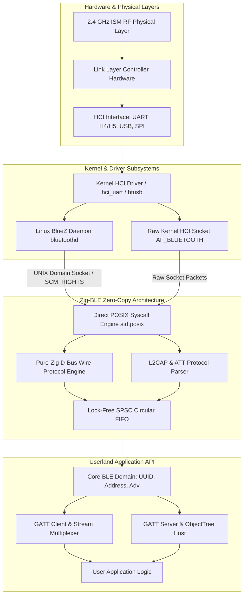
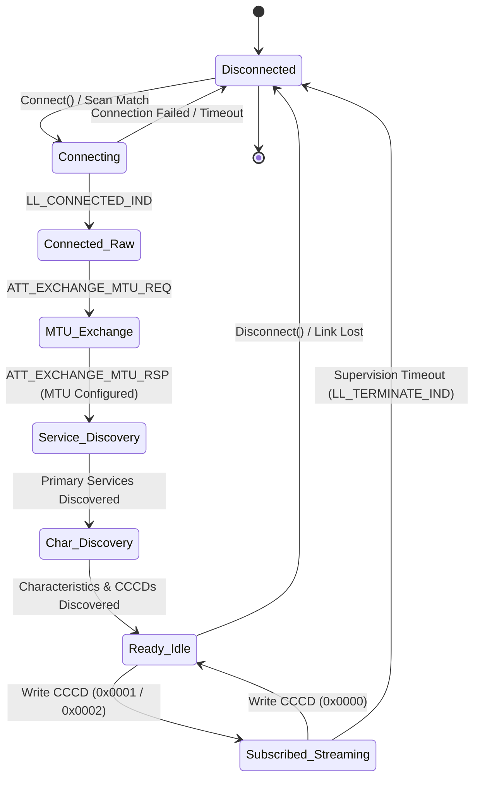

# Zig-BLE: Architecture & Protocol Manual

**Engineering Specification & Systems Reference | Version 1.0**  
**Module:** `Zig_BLE`  
**Compatibility:** Zig 0.16.0+ | Linux BlueZ 5.x / Native POSIX  
**Repository:** [github.com/AritoUser/Zig-BLE](https://github.com/AritoUser/Zig-BLE)  

---

## 1. System Architecture & Stack Abstraction

Zig-BLE is an allocation-conscious, zero-dependency Bluetooth Low Energy (BLE) systems library designed for mission-critical embedded Linux gateways, real-time telemetry pipelines, and bare-metal environments. It models the entire BLE protocol hierarchy—from raw physical frames to high-level GATT applications—without relying on C runtimes or external shared libraries.

### 1.1 Transport Layer Interfaces

The library abstracts the transport medium through dedicated, modular backends:



1. **Linux BlueZ D-Bus Wire Interface (`src/dbus/wire/`)**:
   * Communicates with `bluetoothd` across the standard UNIX domain socket (`/var/run/dbus/system_bus_socket`).
   * Bypasses `libdbus-1` and `GDBus` entirely by synthesizing and parsing binary D-Bus wire messages directly over Linux POSIX system calls (`std.posix.sendmsg`, `recvmsg`, `poll`, `epoll`).
   * Supports `SCM_RIGHTS` ancillary control messages (`cmsg`) for zero-copy file descriptor handovers (used in GATT `AcquireWrite` / `AcquireNotify` streaming).
2. **Direct Kernel HCI Socket Interface (`AF_BLUETOOTH`)**:
   * Direct user-space channel to the Bluetooth Controller via raw HCI sockets (`HCI_CHANNEL_USER` / `HCI_CHANNEL_RAW`).
   * Eliminates the BlueZ daemon overhead completely for minimal embedded systems.
3. **Embedded Bare-Metal Serial HCI (UART H4/H5)**:
   * Direct framing over UART rings for microcontrollers (e.g., Nordic nRF52, Espressif ESP32-C3/C6, STM32WB) using 3-wire slip framing (H5) or 4-wire standard UART (H4).

---

## 2. Memory Management & Data-Flow Architecture

### 2.1 Zero-Allocation on the Hot-Path (`no-alloc`)

In high-throughput sensor telemetry (e.g., multi-channel ECG, 200 Hz IMU sensors, industrial vibration monitoring), dynamic heap allocation (`malloc` / `std.heap.page_allocator`) introduces two catastrophic failure modes:
1. **Latency Spikes**: Heap lock contention and free-list traversal cause non-deterministic processing delays.
2. **Memory Fragmentation**: Long-running embedded gateways experience out-of-memory (OOM) faults after weeks of uptime due to memory fragmentation.

Zig-BLE enforces a strict **Zero-Allocation Guarantee** on all hot-paths:
* **Borrow-Semantics**: Parsers (`AdvertisingReport.parse`, `MessageIter`, `parseNotification`) return structures whose string, byte, and payload members point directly into the underlying socket or frame receive buffer (`[]const u8`).
* **Fixed Stack Workspaces**: Buffer serialization (e.g., `MessageWriter`, `Message.finalize`, `AdvertisingDataBuilder`) uses bounded, deterministic stack buffers.

### 2.2 Lock-Free SPSC Circular FIFO (Ring Buffer)

To decouple high-frequency I/O packet reception from application processing without lock contention, Zig-BLE implements a Single-Producer Single-Consumer (SPSC) lock-free ring buffer:

$$\text{Capacity} = 2^k \quad (k \in \mathbb{N})$$

$$\text{Mask} = \text{Capacity} - 1$$

$$\text{Index}_{\text{physical}} = \text{Sequence} \land \text{Mask}$$

```
+-----------------------------------------------------------------------+
| SPSC Lock-Free Circular Ring Buffer                                   |
|                                                                       |
|  [0]      [1]      [2]      [3]      [4]      [5]      [6]      [7]   |
| +------+ +------+ +------+ +------+ +------+ +------+ +------+ +------+
| | Slot | | Slot | | Slot | | Slot | | Slot | | Slot | | Slot | | Slot |
| +------+ +------+ +------+ +------+ +------+ +------+ +------+ +------+
|             ^                                  ^                      |
|             |                                  |                      |
|       Tail (Consumer)                    Head (Producer)              |
|       Atomic(usize)                      Atomic(usize)                |
|       Cache-Line Padded (64B)            Cache-Line Padded (64B)      |
+-----------------------------------------------------------------------+
```

#### Cache-Line Padding & False Sharing Elimination
To maximize hardware performance on multi-core processors, the `head` (written by the I/O thread) and `tail` (written by the worker thread) pointers are separated by 64 bytes of padding (matching modern CPU L1 data cache lines):
```zig
pub fn RingBuffer(comptime T: type, comptime capacity: usize) type {
    std.debug.assert(std.math.isPowerOfTwo(capacity));
    return struct {
        const Self = @This();
        const mask = capacity - 1;

        slots: [capacity]T = undefined,
        
        // Align head to separate cache line to prevent false sharing
        head: std.atomic.Value(usize) align(64) = std.atomic.Value(usize).init(0),
        
        // Align tail to separate cache line
        tail: std.atomic.Value(usize) align(64) = std.atomic.Value(usize).init(0),

        pub fn push(self: *Self, item: T) bool {
            const h = self.head.load(.monotonic);
            const t = self.tail.load(.acquire);
            if (h -% t >= capacity) return false; // Buffer full

            self.slots[h & mask] = item;
            self.head.store(h +% 1, .release);
            return true;
        }

        pub fn pop(self: *Self) ?T {
            const t = self.tail.load(.monotonic);
            const h = self.head.load(.acquire);
            if (t == h) return null; // Buffer empty

            const item = self.slots[t & mask];
            self.tail.store(t +% 1, .release);
            return item;
        }
    };
}
```

### 2.3 Struct Packing, Endianness & Hardware Alignment

#### `packed struct` vs. `extern struct`
* **`packed struct`**: Used exclusively for bitfields defined by the Bluetooth specification where bit layout must be exact down to the individual bit (e.g., `CharacteristicProperties` 8-bit flags, `AdvertisingFlags`, `Cccd` 16-bit descriptor).
* **Endianness Traps**: Direct pointer casts (`@ptrCast(*const u32, &bytes)`) cause **Hardware Alignment Traps (SIGBUS)** on ARMv6, ARMv7, and RISC-V platforms when pointers are not aligned to 4-byte or 8-byte boundaries.
* **Zig-BLE Deterministic Reading**: Zig-BLE mandates `std.mem.readInt(..., .little)` and `std.mem.writeInt(..., .little)` across all wire layers. On x86/ARM64 this compiles to single-instruction unaligned loads; on strict-alignment microcontrollers it emits valid assembly instructions without trap exceptions.

---

## 3. GATT Model & Formal State Machine

### 3.1 Connection Lifecycle State Machine

The interaction between a Central device and a Peripheral follows a deterministic finite state machine (FSM):



#### Formal State Definitions
1. **`Disconnected`**: The radio is idle or in passive/active scanning mode. No Link Layer connection exists.
2. **`Connecting`**: A connection request PDU (`CONNECT_IND` / `AUX_CONNECT_REQ`) has been transmitted. The connection supervision timer is initialized.
3. **`Connected_Raw`**: Link Layer is connected, but ATT MTU is at default baseline (23 bytes; 20 bytes maximum payload).
4. **`MTU_Exchange`**: Asymmetric client-server negotiation of Maximum Transmission Unit ($23 \le \text{MTU} \le 517$).
5. **`Service_Discovery`**: Enumeration of Primary and Secondary GATT Services (`0x2800`, `0x2801`) via BlueZ ObjectManager or ATT Read By Group Type requests.
6. **`Characteristic_Discovery`**: Enumeration of Characteristics (`0x2803`) and Descriptors (`CCCD 0x2902`, `CUDD 0x2901`).
7. **`Subscribed_Streaming`**: Active notification/indication subscription via Client Characteristic Configuration Descriptor. Sensor data streams into the notification dispatcher.

### 3.2 Backpressure & Saturation Policies

When peripheral sensors transmit notifications faster than the application consumer can process them (e.g., telemetry burst at 200 Hz), the queue will saturate. Zig-BLE defines three formal backpressure policies:

| Policy | Behavior on Buffer Full | Data Guarantee | Typical Use Case |
| :--- | :--- | :--- | :--- |
| **`Drop-Oldest` (Lossy)** | Overwrites the oldest packet in the circular buffer. | **Latest State Guaranteed**; older samples discarded. | Real-time dashboards, battery telemetry, live UI gauges. |
| **`Drop-Newest` (Lossy)** | Rejects incoming packet; retains buffer backlog. | **Historical Continuity Guaranteed**; new samples lost. | State transition logging, alert sequence auditing. |
| **`Block / Throttle` (Lossless)** | Blocks producer thread or suspends socket polling (`EPOLL_CTL_MOD` removing `EPOLLIN`). | **Zero Loss Guaranteed**; radio flow control halts peer. | OTA Firmware Updates, bulk file transfer, medical ECG dumps. |

---

## 4. Byte-Level Packet Specifications

### 4.1 ATT Handle Value Notification (`ATT_HANDLE_VALUE_NTF`)

Transmitted from GATT Server to GATT Client without acknowledgment (Opcode `0x1B`):

| Byte Offset | Field Name | Type / Wire Format | Description |
| :---: | :--- | :---: | :--- |
| `0x00` | **Opcode** | `u8` | `0x1B` (`ATT_HANDLE_VALUE_NTF`) |
| `0x01` | **Attribute Handle (LSB)** | `u8` | Characteristic Value Handle (Little-Endian low byte) |
| `0x02` | **Attribute Handle (MSB)** | `u8` | Characteristic Value Handle (Little-Endian high byte) |
| `0x03 .. end` | **Attribute Value** | `[N]u8` | Raw payload ($0 \le N \le \text{ATT\_MTU} - 3$) |

* *Example*: Handle `0x002A` with payload `[0x01, 0xFF]`:
  $$\texttt{[ 0x1B, 0x2A, 0x00, 0x01, 0xFF ]}$$

### 4.2 ATT Write Request & Command (`ATT_WRITE_REQ` / `ATT_WRITE_CMD`)

| Byte Offset | Field Name | Type / Wire Format | Description |
| :---: | :--- | :---: | :--- |
| `0x00` | **Opcode** | `u8` | `0x12` (`ATT_WRITE_REQ`) or `0x52` (`ATT_WRITE_CMD`) |
| `0x01` | **Attribute Handle (LSB)** | `u8` | Target Handle (Little-Endian low byte) |
| `0x02` | **Attribute Handle (MSB)** | `u8` | Target Handle (Little-Endian high byte) |
| `0x03 .. end` | **Attribute Value** | `[N]u8` | Written data ($0 \le N \le \text{ATT\_MTU} - 3$) |

### 4.3 D-Bus Fixed Header Wire Layout (16 Bytes)

Standard freedesktop.org D-Bus binary message header:

| Byte Offset | Field Name | Type | Allowed Values / Wire Meaning |
| :---: | :--- | :---: | :--- |
| `0x00` | **Endianness** | `u8` | `'l'` (`0x6C`) = Little-Endian, `'B'` (`0x42`) = Big-Endian |
| `0x01` | **Message Type** | `u8` | 1 = Method Call, 2 = Method Return, 3 = Error, 4 = Signal |
| `0x02` | **Flags** | `u8` | `0x01` = No Reply Expected, `0x02` = No Auto Start, `0x04` = Allow Interactive Auth |
| `0x03` | **Protocol Version** | `u8` | Must be `1` |
| `0x04 - 0x07` | **Body Length** | `u32` | Byte length of the message body (excluding header & padding) |
| `0x08 - 0x0B` | **Serial** | `u32` | Unique client sequence counter (never `0`) |
| `0x0C - 0x0F` | **Fields Length** | `u32` | Total byte size of the `a(yv)` Header Fields array |

### 4.4 D-Bus Header Fields Array (`a(yv)`) & Alignment Padding

Following the 16-byte fixed header, the variable header fields array begins at offset 16:
* Each field is a struct `(yv)` containing:
  * Field Code (`u8`): 1=Path, 2=Interface, 3=Member, 4=ErrorName, 5=ReplySerial, 6=Destination, 7=Sender, 8=Signature, 9=UnixFDs.
  * Single-byte Variant Signature Length (`u8`), followed by the signature ASCII byte, followed by a null-terminator.
  * Aligned value payload.
* **Deterministic 8-Byte Body Alignment**:
  $$\text{Body Offset} = 16 + \text{Fields Length} + \text{calcHeaderPadding}(\text{Fields Length})$$
  $$\text{calcHeaderPadding}(len) = (8 - ((16 + len) \pmod 8)) \pmod 8$$

### 4.5 Bluetooth LE Advertising LTV Structure

Legacy advertising packets (31 bytes max) and Extended Advertising PDUs comprise sequential Length-Type-Value (LTV) chunks:

| Byte Offset | Field Name | Size | Description |
| :---: | :--- | :---: | :--- |
| `0x00` | **Length** | `1 Byte` | Total length of remaining chunk ($N + 1$) |
| `0x01` | **AD Type** | `1 Byte` | Assigned AD Type code (e.g., `0x01`=Flags, `0x09`=Complete Name, `0xFF`=Mfg) |
| `0x02 .. N+1` | **AD Data** | `$N$ Bytes` | Payload data (Manufacturer ID, UTF-8 Name, UUID list) |

---

## 5. Tooling & Automated Documentation Pipeline

Zig-BLE provides integrated native tooling to generate both interactive HTML API documentation and compiler-verified test logs.

### 5.1 Generating Interactive HTML Documentation

The library uses Zig's native documentation engine (`getEmittedDocs()`). To compile and export the full HTML API documentation:

```bash
zig build docs
```

The resulting interactive documentation is generated in `zig-out/docs/`:
* `index.html`: Fully interactive, searchable API browser.
* `main.js` & `main.wasm`: Client-side search index and type cross-reference engine.
* `sources.tar`: Embedded syntax-highlighted source code browser.

### 5.2 Compiling with mdBook (Optional Handbuch Build)

To serve this architecture manual and the technical white paper as an interactive web book:

```bash
# Install mdBook if not already installed
cargo install mdbook

# Build the book
mdbook build docs

# Serve with live reload on http://localhost:3000
mdbook serve docs
```

---

## 6. References & Standards Compliance

1. **Bluetooth SIG**: *Bluetooth Core Specification v5.4 & v6.0*, Volume 3: Core System Architecture, Part F (Attribute Protocol) & Part G (Generic Attribute Profile).
2. **freedesktop.org**: *D-Bus Specification*, Version 0.30+, [https://dbus.freedesktop.org/doc/dbus-specification.html](https://dbus.freedesktop.org/doc/dbus-specification.html).
3. **Linux Foundation**: *BlueZ Linux Bluetooth Subsystem API Documentation*, `doc/adapter-api.txt`, `doc/device-api.txt`, `doc/gatt-api.txt`.
4. **POSIX IEEE Std 1003.1-2017**: Standard for Information Technology—Portable Operating System Interface (POSIX), UNIX Domain Sockets & `SCM_RIGHTS`.
5. **The Zig Software Foundation**: *The Zig Language Specification (0.16.0)*, Memory Safety, Comptime, and Alignment Guarantees.
