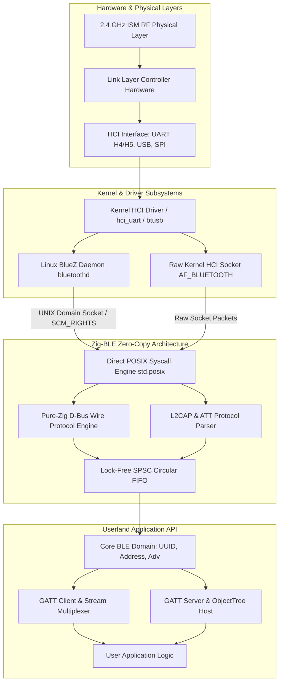
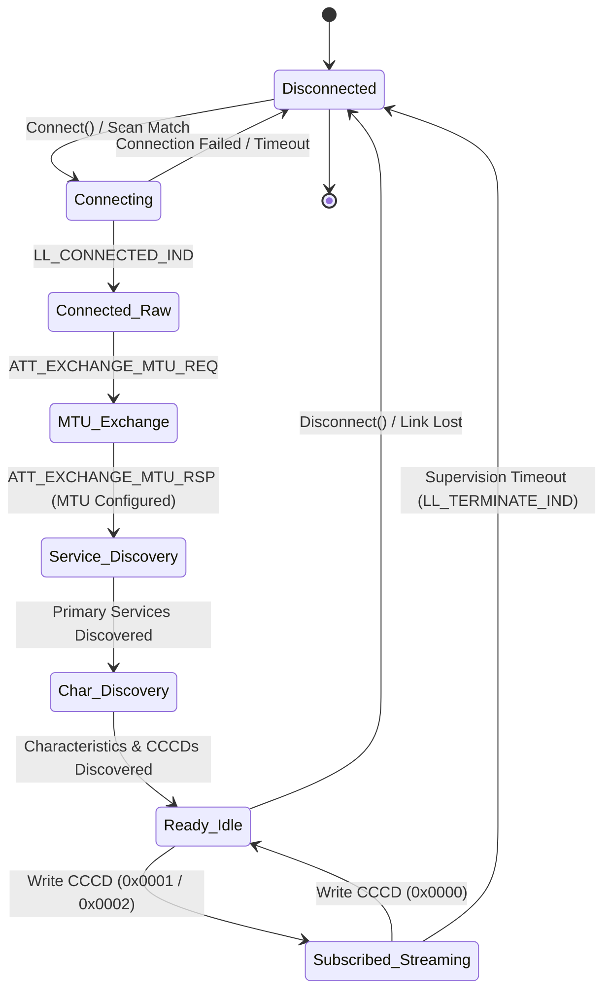

# Zig-BLE: Architecture & Protocol Manual

**Engineering Specification & Systems Reference | Version 1.1 (v0.2.0 Release)**  
**Module:** `Zig_BLE`  
**Compatibility:** Zig 0.16.0+ | Linux BlueZ 5.x / Native POSIX  
**Repository:** [github.com/AritoUser/Zig-BLE](https://github.com/AritoUser/Zig-BLE)  

---

## 1. System Architecture & Stack Abstraction

Zig-BLE is an allocation-conscious, zero-dependency Bluetooth Low Energy (BLE) systems library designed for mission-critical embedded Linux gateways, real-time telemetry pipelines, and bare-metal environments. It models the entire BLE protocol hierarchy—from raw physical frames to high-level GATT applications—without relying on C runtimes or external shared libraries.

### 1.1 Transport Layer Interfaces

The library abstracts the transport medium through dedicated, modular backends:



1. **Linux BlueZ D-Bus Wire Interface (`src/dbus/wire/`)**:
   * Communicates with `bluetoothd` across the standard UNIX domain socket (`/var/run/dbus/system_bus_socket`).
   * Bypasses `libdbus-1` and `GDBus` entirely by synthesizing and parsing binary D-Bus wire messages directly over Linux POSIX system calls (`std.posix.sendmsg`, `recvmsg`, `poll`, `epoll`).
   * Supports `SCM_RIGHTS` ancillary control messages (`cmsg`) for zero-copy file descriptor handovers (used in GATT `AcquireWrite` / `AcquireNotify` streaming).
2. **Direct Kernel HCI Socket Interface (`AF_BLUETOOTH`)**:
   * Direct user-space channel to the Bluetooth Controller via raw HCI sockets (`HCI_CHANNEL_USER` / `HCI_CHANNEL_RAW`).
   * Eliminates the BlueZ daemon overhead completely for minimal embedded systems.
3. **Embedded Bare-Metal Serial HCI (UART H4/H5)**:
   * Direct framing over UART rings for microcontrollers (e.g., Nordic nRF52, Espressif ESP32-C3/C6, STM32WB) using 3-wire slip framing (H5) or 4-wire standard UART (H4).

---

## 2. Memory Management & Data-Flow Architecture

### 2.1 Zero-Allocation on the Hot-Path (`no-alloc`)

In high-throughput sensor telemetry (e.g., multi-channel ECG, 200 Hz IMU sensors, industrial vibration monitoring), dynamic heap allocation (`malloc` / `std.heap.page_allocator`) introduces two catastrophic failure modes:
1. **Latency Spikes**: Heap lock contention and free-list traversal cause non-deterministic processing delays.
2. **Memory Fragmentation**: Long-running embedded gateways experience out-of-memory (OOM) faults after weeks of uptime due to memory fragmentation.

Zig-BLE enforces a strict **Zero-Allocation Guarantee** on all hot-paths:
* **Borrow-Semantics**: Parsers (`AdvertisingReport.parse`, `MessageIter`, `parseNotification`) return structures whose string, byte, and payload members point directly into the underlying socket or frame receive buffer (`[]const u8`).
* **Fixed Stack Workspaces**: Buffer serialization (e.g., `MessageWriter`, `Message.finalize`, `AdvertisingDataBuilder`) uses bounded, deterministic stack buffers.

### 2.2 Lock-Free SPSC Circular FIFO (Ring Buffer)

To decouple high-frequency I/O packet reception from application processing without lock contention, Zig-BLE implements a Single-Producer Single-Consumer (SPSC) lock-free ring buffer:

$$\text{Capacity} = 2^k \quad (k \in \mathbb{N})$$

$$\text{Mask} = \text{Capacity} - 1$$

$$\text{Index}_{\text{physical}} = \text{Sequence} \land \text{Mask}$$

```
+-----------------------------------------------------------------------+
| SPSC Lock-Free Circular Ring Buffer                                   |
|                                                                       |
|  [0]      [1]      [2]      [3]      [4]      [5]      [6]      [7]   |
| +------+ +------+ +------+ +------+ +------+ +------+ +------+ +------+
| | Slot | | Slot | | Slot | | Slot | | Slot | | Slot | | Slot | | Slot |
| +------+ +------+ +------+ +------+ +------+ +------+ +------+ +------+
|             ^                                  ^                      |
|             |                                  |                      |
|       Tail (Consumer)                    Head (Producer)              |
|       Atomic(usize)                      Atomic(usize)                |
|       Cache-Line Padded (64B)            Cache-Line Padded (64B)      |
+-----------------------------------------------------------------------+
```

#### Cache-Line Padding & False Sharing Elimination
To maximize hardware performance on multi-core processors, the `head` (written by the I/O thread) and `tail` (written by the worker thread) pointers are separated by 64 bytes of padding (matching modern CPU L1 data cache lines):
```zig
pub fn RingBuffer(comptime T: type, comptime capacity: usize) type {
    std.debug.assert(std.math.isPowerOfTwo(capacity));
    return struct {
        const Self = @This();
        const mask = capacity - 1;

        slots: [capacity]T = undefined,
        
        // Align head to separate cache line to prevent false sharing
        head: std.atomic.Value(usize) align(64) = std.atomic.Value(usize).init(0),
        
        // Align tail to separate cache line
        tail: std.atomic.Value(usize) align(64) = std.atomic.Value(usize).init(0),

        pub fn push(self: *Self, item: T) bool {
            const h = self.head.load(.monotonic);
            const t = self.tail.load(.acquire);
            if (h -% t >= capacity) return false; // Buffer full

            self.slots[h & mask] = item;
            self.head.store(h +% 1, .release);
            return true;
        }

        pub fn pop(self: *Self) ?T {
            const t = self.tail.load(.monotonic);
            const h = self.head.load(.acquire);
            if (t == h) return null; // Buffer empty

            const item = self.slots[t & mask];
            self.tail.store(t +% 1, .release);
            return item;
        }
    };
}
```

### 2.3 Struct Packing, Endianness & Hardware Alignment

#### `packed struct` vs. `extern struct`
* **`packed struct`**: Used exclusively for bitfields defined by the Bluetooth specification where bit layout must be exact down to the individual bit (e.g., `CharacteristicProperties` 8-bit flags, `AdvertisingFlags`, `Cccd` 16-bit descriptor).
* **Endianness Traps**: Direct pointer casts (`@ptrCast(*const u32, &bytes)`) cause **Hardware Alignment Traps (SIGBUS)** on ARMv6, ARMv7, and RISC-V platforms when pointers are not aligned to 4-byte or 8-byte boundaries.
* **Zig-BLE Deterministic Reading**: Zig-BLE mandates `std.mem.readInt(..., .little)` and `std.mem.writeInt(..., .little)` across all wire layers. On x86/ARM64 this compiles to single-instruction unaligned loads; on strict-alignment microcontrollers it emits valid assembly instructions without trap exceptions.

---

## 3. GATT Model & Formal State Machine

### 3.1 Connection Lifecycle State Machine

The interaction between a Central device and a Peripheral follows a deterministic finite state machine (FSM):



#### Formal State Definitions
1. **`Disconnected`**: The radio is idle or in passive/active scanning mode. No Link Layer connection exists.
2. **`Connecting`**: A connection request PDU (`CONNECT_IND` / `AUX_CONNECT_REQ`) has been transmitted. The connection supervision timer is initialized.
3. **`Connected_Raw`**: Link Layer is connected, but ATT MTU is at default baseline (23 bytes; 20 bytes maximum payload).
4. **`MTU_Exchange`**: Asymmetric client-server negotiation of Maximum Transmission Unit ($23 \le \text{MTU} \le 517$).
5. **`Service_Discovery`**: Enumeration of Primary and Secondary GATT Services (`0x2800`, `0x2801`) via BlueZ ObjectManager or ATT Read By Group Type requests.
6. **`Characteristic_Discovery`**: Enumeration of Characteristics (`0x2803`) and Descriptors (`CCCD 0x2902`, `CUDD 0x2901`).
7. **`Subscribed_Streaming`**: Active notification/indication subscription via Client Characteristic Configuration Descriptor. Sensor data streams into the notification dispatcher.

### 3.2 Backpressure & Saturation Policies

When peripheral sensors transmit notifications faster than the application consumer can process them (e.g., telemetry burst at 200 Hz), the queue will saturate. Zig-BLE defines three formal backpressure policies:

| Policy | Behavior on Buffer Full | Data Guarantee | Typical Use Case |
| :--- | :--- | :--- | :--- |
| **`Drop-Oldest` (Lossy)** | Overwrites the oldest packet in the circular buffer. | **Latest State Guaranteed**; older samples discarded. | Real-time dashboards, battery telemetry, live UI gauges. |
| **`Drop-Newest` (Lossy)** | Rejects incoming packet; retains buffer backlog. | **Historical Continuity Guaranteed**; new samples lost. | State transition logging, alert sequence auditing. |
| **`Block / Throttle` (Lossless)** | Blocks producer thread or suspends socket polling (`EPOLL_CTL_MOD` removing `EPOLLIN`). | **Zero Loss Guaranteed**; radio flow control halts peer. | OTA Firmware Updates, bulk file transfer, medical ECG dumps. |

---

## 4. Byte-Level Packet Specifications

### 4.1 ATT Handle Value Notification (`ATT_HANDLE_VALUE_NTF`)

Transmitted from GATT Server to GATT Client without acknowledgment (Opcode `0x1B`):

| Byte Offset | Field Name | Type / Wire Format | Description |
| :---: | :--- | :---: | :--- |
| `0x00` | **Opcode** | `u8` | `0x1B` (`ATT_HANDLE_VALUE_NTF`) |
| `0x01` | **Attribute Handle (LSB)** | `u8` | Characteristic Value Handle (Little-Endian low byte) |
| `0x02` | **Attribute Handle (MSB)** | `u8` | Characteristic Value Handle (Little-Endian high byte) |
| `0x03 .. end` | **Attribute Value** | `[N]u8` | Raw payload ($0 \le N \le \text{ATT\_MTU} - 3$) |

* *Example*: Handle `0x002A` with payload `[0x01, 0xFF]`:
  $$\texttt{[ 0x1B, 0x2A, 0x00, 0x01, 0xFF ]}$$

### 4.2 ATT Write Request & Command (`ATT_WRITE_REQ` / `ATT_WRITE_CMD`)

| Byte Offset | Field Name | Type / Wire Format | Description |
| :---: | :--- | :---: | :--- |
| `0x00` | **Opcode** | `u8` | `0x12` (`ATT_WRITE_REQ`) or `0x52` (`ATT_WRITE_CMD`) |
| `0x01` | **Attribute Handle (LSB)** | `u8` | Target Handle (Little-Endian low byte) |
| `0x02` | **Attribute Handle (MSB)** | `u8` | Target Handle (Little-Endian high byte) |
| `0x03 .. end` | **Attribute Value** | `[N]u8` | Written data ($0 \le N \le \text{ATT\_MTU} - 3$) |

### 4.3 D-Bus Fixed Header Wire Layout (16 Bytes)

Standard freedesktop.org D-Bus binary message header:

| Byte Offset | Field Name | Type | Allowed Values / Wire Meaning |
| :---: | :--- | :---: | :--- |
| `0x00` | **Endianness** | `u8` | `'l'` (`0x6C`) = Little-Endian, `'B'` (`0x42`) = Big-Endian |
| `0x01` | **Message Type** | `u8` | 1 = Method Call, 2 = Method Return, 3 = Error, 4 = Signal |
| `0x02` | **Flags** | `u8` | `0x01` = No Reply Expected, `0x02` = No Auto Start, `0x04` = Allow Interactive Auth |
| `0x03` | **Protocol Version** | `u8` | Must be `1` |
| `0x04 - 0x07` | **Body Length** | `u32` | Byte length of the message body (excluding header & padding) |
| `0x08 - 0x0B` | **Serial** | `u32` | Unique client sequence counter (never `0`) |
| `0x0C - 0x0F` | **Fields Length** | `u32` | Total byte size of the `a(yv)` Header Fields array |

### 4.4 D-Bus Header Fields Array (`a(yv)`) & Alignment Padding

Following the 16-byte fixed header, the variable header fields array begins at offset 16:
* Each field is a struct `(yv)` containing:
  * Field Code (`u8`): 1=Path, 2=Interface, 3=Member, 4=ErrorName, 5=ReplySerial, 6=Destination, 7=Sender, 8=Signature, 9=UnixFDs.
  * Single-byte Variant Signature Length (`u8`), followed by the signature ASCII byte, followed by a null-terminator.
  * Aligned value payload.
* **Deterministic 8-Byte Body Alignment**:
  $$\text{Body Offset} = 16 + \text{Fields Length} + \text{calcHeaderPadding}(\text{Fields Length})$$
  $$\text{calcHeaderPadding}(len) = (8 - ((16 + len) \pmod 8)) \pmod 8$$

### 4.5 Bluetooth LE Advertising LTV Structure

Legacy advertising packets (31 bytes max) and Extended Advertising PDUs comprise sequential Length-Type-Value (LTV) chunks:

| Byte Offset | Field Name | Size | Description |
| :---: | :--- | :---: | :--- |
| `0x00` | **Length** | `1 Byte` | Total length of remaining chunk ($N + 1$) |
| `0x01` | **AD Type** | `1 Byte` | Assigned AD Type code (e.g., `0x01`=Flags, `0x09`=Complete Name, `0xFF`=Mfg) |
| `0x02 .. N+1` | **AD Data** | `$N$ Bytes` | Payload data (Manufacturer ID, UTF-8 Name, UUID list) |

### 4.6 Apple iBeacon Wire Specification (23-Byte Payload)

Transmitted inside the Manufacturer Specific Data (`AD Type 0xFF`) record with Apple's Company Identifier (`0x004C` Little-Endian: `[0x4C, 0x00]`):

| Byte Offset | Field Name | Wire Type | Expected Value / Range | Description |
| :---: | :--- | :---: | :---: | :--- |
| `0x00` | **Beacon Sub-Type** | `u8` | `0x02` | Proximity Beacon Type Code |
| `0x01` | **Remaining Length** | `u8` | `0x15` (`21` bytes) | Payload size through Measured Power |
| `0x02 .. 0x11` | **Proximity UUID** | `[16]u8` | 128-bit Big-Endian | Deployment / Region UUID |
| `0x12 .. 0x13` | **Major ID** | `u16` | Big-Endian `u16` | Sub-region or site identifier |
| `0x14 .. 0x15` | **Minor ID** | `u16` | Big-Endian `u16` | Specific beacon or point identifier |
| `0x16` | **Measured Power** | `i8` | 2's Complement `i8` | Calibrated RSSI in dBm at 1 meter distance |

### 4.7 Google Eddystone Frame Specifications

Eddystone beacons broadcast under the 16-bit Service UUID `0xFEAA` (`AD Type 0x16` Service Data 16-bit UUID):

#### Eddystone-UID (`Frame Type 0x00`)
| Byte Offset | Field Name | Size | Description |
| :---: | :--- | :---: | :--- |
| `0x00` | **Frame Type** | `1 Byte` | `0x00` |
| `0x01` | **Ranging Data** | `1 Byte` | Calibrated TX power in dBm at 0 meters |
| `0x02 .. 0x0B` | **Namespace ID** | `10 Bytes` | Unique organizational identifier |
| `0x0C .. 0x11` | **Instance ID** | `6 Bytes` | Specific beacon device identifier |
| `0x12 .. 0x13` | **Reserved** | `2 Bytes` | `0x00, 0x00` |

#### Eddystone-URL (`Frame Type 0x10`)
| Byte Offset | Field Name | Size | Description |
| :---: | :--- | :---: | :--- |
| `0x00` | **Frame Type** | `1 Byte` | `0x10` |
| `0x01` | **TX Power** | `1 Byte` | Calibrated TX power in dBm at 0 meters |
| `0x02` | **URL Scheme** | `1 Byte` | `0x00`=http://www., `0x01`=https://www., `0x02`=http://, `0x03`=https:// |
| `0x03 .. end` | **Encoded URL** | `$N$ Bytes` | ASCII characters with single-byte suffix expansion (e.g., `0x00`=`.com/`) |

#### Eddystone-TLM (`Frame Type 0x20`)
| Byte Offset | Field Name | Size | Description |
| :---: | :--- | :---: | :--- |
| `0x00` | **Frame Type** | `1 Byte` | `0x20` |
| `0x01` | **Version** | `1 Byte` | `0x00` (Unencrypted TLM) |
| `0x02 .. 0x03` | **Battery Voltage** | `2 Bytes` | Big-Endian `u16` in millivolts (mV) |
| `0x04 .. 0x05` | **Beacon Temperature**| `2 Bytes` | Big-Endian Fixed-Point 8.8 signed integer in °C |
| `0x06 .. 0x09` | **ADV Packet Count** | `4 Bytes` | Big-Endian `u32` running counter since boot |
| `0x0A .. 0x0D` | **SEC01 Time (Uptime)**| `4 Bytes` | Big-Endian `u32` in 0.1-second intervals since boot |

### 4.8 GATT Standard Profiles Binary Layouts

#### Heart Rate Measurement (`UUID 0x2A37`)
* **Byte 0 (Flags)**:
  * Bit 0: Value Format (`0` = UINT8 BPM, `1` = UINT16 BPM)
  * Bits 1–2: Sensor Contact Status (`0b10` = Not detected, `0b11` = Detected)
  * Bit 3: Energy Expended Status (`1` = Present as 16-bit Joules)
  * Bit 4: RR-Interval Status (`1` = One or more 16-bit RR-intervals present)
* **Byte 1 (+2)**: Heart rate magnitude (8-bit or 16-bit Little-Endian)
* **Subsequent bytes**: Optional Energy Expended (`u16` Little-Endian) and sequence of RR-intervals (`u16` Little-Endian in 1/1024-second units).

#### Environmental Sensing Service (`UUID 0x181A`)
* **Temperature (`0x2A6E`)**: Signed 16-bit integer (`i16` Little-Endian), scaling factor $10^{-2}$ ($0.01$ °C).
* **Humidity (`0x2A6F`)**: Unsigned 16-bit integer (`u16` Little-Endian), scaling factor $10^{-2}$ ($0.01$ %).
* **Pressure (`0x2A6D`)**: Unsigned 32-bit integer (`u32` Little-Endian), scaling factor $10^{-1}$ ($0.1$ Pa).

### 4.9 Linux Kernel L2CAP Connection-Oriented Channels (CoC)

For point-to-point binary transport bypassing ATT/GATT MTU ceilings, Zig-BLE communicates over native Linux `AF_BLUETOOTH` sockets (`BTPROTO_L2CAP`):

```
+-----------------------------------------------------------------------+
| sockaddr_l2 (POSIX Socket Address Structure)                          |
|                                                                       |
|  Offset  Size   Field Name         Value / Description                |
|  +00     2 B    sa_family          AF_BLUETOOTH (31)                  |
|  +02     2 B    l2_psm             Protocol Service Multiplexer (LE)  |
|  +04     6 B    l2_bdaddr          Remote Bluetooth MAC (Little-Endian)|
|  +10     2 B    l2_cid             Fixed Channel ID (0 for dynamic)   |
|  +12     1 B    l2_bdaddr_type     1 = BDADDR_LE_PUBLIC, 2 = RANDOM  |
+-----------------------------------------------------------------------+
```

Credit-based flow control is managed transparently by the Linux kernel Bluetooth subsystem (`l2cap_core.ko`), ensuring zero packet loss and automatic TCP-like stream backpressure.

---

## 5. Tooling & Automated Documentation Pipeline

Zig-BLE provides integrated native tooling to generate both interactive HTML API documentation and compiler-verified test logs.

### 5.1 Generating Interactive HTML Documentation

The library uses Zig's native documentation engine (`getEmittedDocs()`). To compile and export the full HTML API documentation:

```bash
zig build docs
```

The resulting interactive documentation is generated in `zig-out/docs/`:
* `index.html`: Fully interactive, searchable API browser.
* `main.js` & `main.wasm`: Client-side search index and type cross-reference engine.
* `sources.tar`: Embedded syntax-highlighted source code browser.

### 5.2 Compiling with mdBook (Optional Handbuch Build)

To serve this architecture manual and the technical white paper as an interactive web book:

```bash
# Install mdBook if not already installed
cargo install mdbook

# Build the book
mdbook build docs

# Serve with live reload on http://localhost:3000
mdbook serve docs
```

---

## 6. GATT Data Typing & Format Engine (IEEE-11073-20601 & 0x2904)

Standardized Bluetooth Low Energy profiles (e.g., Health Thermometer `0x1809`, Pulse Oximeter `0x1822`, Environmental Sensing `0x181A`, Weight Scale `0x181D`) mandate binary floating-point encodings adhering to the **IEEE-11073-20601 Medical Device Communication Standard**.

Zig-BLE provides zero-allocation, mathematically verified decoders and encoders for these types, directly integrated into the client and server GATT pipelines.

### 6.1 IEEE-11073-20601 16-Bit SFLOAT & 32-Bit FLOAT

An IEEE-11073 floating-point number is expressed as a signed two's-complement mantissa scaled by an integer power of 10:

$$\text{Value} = \text{Mantissa} \times 10^{\text{Exponent}}$$

#### Bit Layout & Boundary Characteristics

| Type | Total Width | Mantissa Width | Mantissa Range | Exponent Width | Exponent Range | Decimal Precision |
| :--- | :--- | :--- | :--- | :--- | :--- | :--- |
| **SFLOAT** | 16 bits | 12 bits (bits 0..11) | $-2048 \dots +2047$ | 4 bits (bits 12..15) | $-8 \dots +7$ | $\approx 3.3$ digits |
| **FLOAT** | 32 bits | 24 bits (bits 0..23) | $-8,388,608 \dots +8,388,607$ | 8 bits (bits 24..31) | $-128 \dots +127$ | $\approx 6.9$ digits |

#### Special Value Encoding

The standard reserves specific mantissa values to signal out-of-band physiological and hardware states:

| State | SFLOAT (16-bit) Mantissa | FLOAT (32-bit) Mantissa | Mathematical Interpretation |
| :--- | :--- | :--- | :--- |
| **+INFINITY** | `0x07FE` (+2046) | `0x007FFFFE` (+8388606) | Positive overflow |
| **NaN** (Not a Number) | `0x07FF` (+2047) | `0x007FFFFF` (+8388607) | Undefined / mathematical error |
| **NRes** (Not at this Res) | `0x0800` (-2048) | `0x00800000` (-8388608) | Sensor resolution exceeded |
| **Reserved** | `0x0801` (-2047) | `0x00800001` (-8388607) | Reserved for future standardization |
| **-INFINITY** | `0x0802` (-2046) | `0x00800002` (-8388606) | Negative overflow |

In Zig-BLE, these types are represented by `core.Sfloat` and `core.Float32` with full bidirectional conversions to Zig `f32`/`f64` and formatting via `std.fmt`.

### 6.2 Characteristic Presentation Format (UUID 0x2904)

The Bluetooth SIG Characteristic Presentation Format Descriptor (`0x2904`) defines a 7-byte metadata structure attached to characteristics:

```text
+--------+----------+-----------------+-----------+-----------------+
| Byte 0 |  Byte 1  |    Bytes 2..3   |   Byte 4  |    Bytes 5..6   |
| Format | Exponent | Unit (UUID16)   | Namespace | Description ID  |
|  (u8)  |   (i8)   | (little-endian) |  (0x01)   | (little-endian) |
+--------+----------+-----------------+-----------+-----------------+
```

The engine provides automatic presentation decoding:
```zig
const cpf = CharacteristicPresentationFormat{
    .format = .sfloat,
    .exponent = 0,
    .unit = Units.celsius,
};
var buf: [64]u8 = undefined;
const text = try cpf.formatValue(raw_bytes, &buf); // "37.2 °C"
```

### 6.3 Strongly-Typed GATT I/O API

Both GATT Client (`GattCharacteristic`) and GATT Server (`ServerCharacteristic`) support direct typed serialization:
- `char.readTyped(comptime T: type) !T`
- `char.writeTyped(val: anytype, write_type: WriteType) !void`
- `server_char.setTyped(val: anytype) !void`
- `server_char.getTyped(comptime T: type) !T`
- `server_char.notifyTyped(conn: *Connection, val: anytype) !void`
- `server_char.setPresentationFormat(format: CharacteristicPresentationFormat) !*ServerDescriptor`

---

## 7. Zero-Copy Attribute Protocol (ATT) Engine

`Zig-BLE` implements a complete, zero-allocation Attribute Protocol (ATT) PDU codec strictly conforming to **Bluetooth Core Specification v5.4 / v6.0, Vol 3, Part F**.

### 7.1 Supported ATT Opcode Matrix

The engine provides zero-copy parsers and serializers for all 20 standard ATT PDUs:

| Opcode | Command / Request / Response PDU | Zero-Copy Parser / Iterator |
| :--- | :--- | :--- |
| `0x01` | **ATT_ERROR_RSP** | `ErrorResponse.parse(raw)` |
| `0x02` | **ATT_EXCHANGE_MTU_REQ** | `ExchangeMtuRequest.parse(raw)` |
| `0x03` | **ATT_EXCHANGE_MTU_RSP** | `ExchangeMtuResponse.parse(raw)` |
| `0x04` | **ATT_FIND_INFO_REQ** | `FindInformationRequest.parse(raw)` |
| `0x05` | **ATT_FIND_INFO_RSP** | `FindInformationResponse` with zero-allocation `InformationIterator` |
| `0x06` | **ATT_FIND_BY_TYPE_VALUE_REQ** | `FindByTypeValueRequest.parse(raw)` |
| `0x07` | **ATT_FIND_BY_TYPE_VALUE_RSP** | `FindByTypeValueResponse` with `HandlesInformationIterator` |
| `0x08` | **ATT_READ_BY_TYPE_REQ** | `ReadByTypeRequest.parse(raw)` |
| `0x09` | **ATT_READ_BY_TYPE_RSP** | `ReadByTypeResponse` with `ReadByTypeIterator` |
| `0x0A` | **ATT_READ_REQ** | `ReadRequest.parse(raw)` |
| `0x0B` | **ATT_READ_RSP** | `ReadResponse.parse(raw)` |
| `0x0C` | **ATT_READ_BLOB_REQ** | `ReadBlobRequest.parse(raw)` |
| `0x0D` | **ATT_READ_BLOB_RSP** | `ReadBlobResponse.parse(raw)` |
| `0x0E` | **ATT_READ_MULTIPLE_REQ** | `ReadMultipleRequest.parse(raw)` with `HandlesIterator` |
| `0x0F` | **ATT_READ_MULTIPLE_RSP** | `ReadMultipleResponse.parse(raw)` |
| `0x10` | **ATT_READ_BY_GROUP_TYPE_REQ** | `ReadByGroupTypeRequest.parse(raw)` |
| `0x11` | **ATT_READ_BY_GROUP_TYPE_RSP** | `ReadByGroupTypeResponse` with `ReadByGroupTypeIterator` |
| `0x12` | **ATT_WRITE_REQ** | `WriteRequest.parse(raw)` |
| `0x13` | **ATT_WRITE_RSP** | `WriteResponse.parse(raw)` |
| `0x52` | **ATT_WRITE_CMD** | `WriteCommand.parse(raw)` |
| `0xD2` | **ATT_SIGNED_WRITE_CMD** | `SignedWriteCommand.parse(raw)` (with 12-byte MAC signature verification) |
| `0x16` | **ATT_PREPARE_WRITE_REQ** | `PrepareWriteRequest.parse(raw)` |
| `0x17` | **ATT_PREPARE_WRITE_RSP** | `PrepareWriteResponse.parse(raw)` |
| `0x18` | **ATT_EXECUTE_WRITE_REQ** | `ExecuteWriteRequest.parse(raw)` |
| `0x19` | **ATT_EXECUTE_WRITE_RSP** | `ExecuteWriteResponse.parse(raw)` |
| `0x1B` | **ATT_HANDLE_VALUE_NTF** | `HandleValueNotification.parse(raw)` |
| `0x1D` | **ATT_HANDLE_VALUE_IND** | `HandleValueIndication.parse(raw)` |
| `0x1E` | **ATT_HANDLE_VALUE_CFM** | `HandleValueConfirmation.parse(raw)` |

### 7.2 Zero-Allocation Iterator Pattern

ATT discovery responses (e.g. `ATT_READ_BY_GROUP_TYPE_RSP` for service discovery or `ATT_READ_BY_TYPE_RSP` for characteristic discovery) return packed variable-length arrays. The engine uses typed zero-allocation iterators:

```zig
var iter = try rsp.iterator();
while (iter.next()) |item| {
    std.debug.print("Attribute Handle: 0x{X:0>4}, End: 0x{X:0>4}, UUID: {}\n", .{
        item.attribute_handle,
        item.end_group_handle,
        item.uuid,
    });
}
```

---

## 8. BLE Cryptographic Toolbox & Security Manager Protocol (SMP)

Compliant with **Bluetooth Core Specification v5.4 / v6.0, Vol 3, Part H**.

### 8.1 Cryptographic Primitives Matrix

All cryptographic functions are implemented in 100% pure Zig using `std.crypto` (AES-128 and AES-CMAC), verified bit-for-bit against official Bluetooth SIG test vectors:

| Function | Specification | Purpose | Algorithm |
| :--- | :--- | :--- | :--- |
| `e(key, plaintext)` | Vol 3, Part H §2.2.1 | Security function *e* | AES-128 ECB |
| `ah(irk, prand)` | Vol 3, Part H §2.2.2 | Random address hash for RPA | $e(\text{irk}, r') \pmod{2^{24}}$ |
| `c1(k, r, pres, preq, ...)` | Vol 3, Part H §2.2.3 | Legacy pairing confirm value generation | AES-128 multistage |
| `s1(k, r1, r2)` | Vol 3, Part H §2.2.4 | Legacy STK generation | AES-128 |
| `f4(u, v, x, z)` | Vol 3, Part H §2.2.5 | LE Secure Connections confirm generation | AES-CMAC-128 |
| `f5(w, n1, n2, a1, a2)` | Vol 3, Part H §2.2.6 | LE Secure Connections LTK & MacKey | AES-CMAC-128 |
| `f6(w, n1, n2, r, ...)` | Vol 3, Part H §2.2.7 | LE Secure Connections check value | AES-CMAC-128 |
| `g2(u, v, x, y)` | Vol 3, Part H §2.2.8 | 6-digit numeric comparison computation | $\text{AES-CMAC}_x \pmod{10^6}$ |
| `h6(w, keyid)` | Vol 3, Part H §2.2.9 | Link Key conversion function | AES-CMAC-128 |
| `signAtt(csrk, msg, cnt)` | Vol 3, Part C §10.4.1 | ATT Signed Write authentication (12-byte MAC) | AES-CMAC-128 |
| `gattHash(db_chunks)` | Bluetooth 5.1+ §2B2A | Database Hash Characteristic calculation | AES-CMAC-128 with key $0^{128}$ |
| `sih(sirk, prand)` | CSIP / LE Audio | Set Identity Resolving Key hash | $e(\text{sirk}, r') \pmod{2^{24}}$ |
| `generateRsi(sirk)` | CSIP / LE Audio | Resolvable Set Identifier generation | 6-byte coordinated set tag |

### 8.2 Resolvable Private Address (RPA) Resolution & Generation

```zig
// 1. Resolve an incoming RPA MAC address against a bonded Identity Resolving Key (IRK):
const matches = Zig_BLE.resolveRpa(irk, peer_address);

// 2. Generate a new Resolvable Private Address (RPA):
const rpa = Zig_BLE.generateRpa(my_irk, null);
std.debug.print("Rotated MAC: {s}\n", .{rpa.toString()});
```

### 8.3 Security Manager Protocol (SMP) PDU Engine (L2CAP CID 0x0006)

Complete zero-copy representation of all standard SMP packets:
- `PairingRequest` & `PairingResponse` (`AuthReq`, `IoCapability`, `KeyDistribution`)
- `PairingConfirm` & `PairingRandom`
- `PairingFailed` (`PairingFailedReason`)
- `EncryptionInformation` (LTK)
- `MasterIdentification` (EDIV, Rand)
- `IdentityInformation` (IRK)
- `IdentityAddressInformation` (BD_ADDR, AddressType)
- `SigningInformation` (CSRK)
- `SecurityRequest`
- `PairingPublicKey` (P-256 Public Key coordinates)
- `PairingDhKeyCheck`
- `PairingKeypressNotification`

---

## 9. Standard Bluetooth SIG Profile Ecosystem

All standard profiles are located in `src/profiles/` and feature zero dynamic allocations and IEEE-11073-20601 format compliance:

### 9.1 Device Information Service (DIS - UUID 0x180A)
Exposes manufacturer name, model, serial, hardware, firmware, and software revision strings, along with structured `SystemId` (40-bit manufacturer ID + 24-bit OUI) and `PnpId` (Vendor ID Source, Vendor ID, Product ID, Product Version).

### 9.2 Current Time Service (CTS - UUID 0x1805)
Standardized binary time synchronization containing year, month, day, hours, minutes, seconds, day of week, fractions256, and `AdjustReason` bitfield, as well as `LocalTimeInfo` (UTC 15-minute offset and DST mode).

### 9.3 Health Thermometer Service (HTS - UUID 0x1809)
Medical temperature telemetry utilizing IEEE-11073 32-bit `Float32`, temperature unit conversion (°C / °F), optional DateTime timestamps, and `TemperatureType` body location enumeration.

### 9.4 Blood Pressure Service (BLS - UUID 0x1810)
Standard blood pressure measurements utilizing IEEE-11073 16-bit `Sfloat` for Systolic, Diastolic, Mean Arterial Pressure (MAP), Pulse Rate, and `MeasurementStatus` bitfield (movement, cuff loose, irregular pulse detection).

### 9.5 Human Interface Device over GATT (HOGP / HID - UUID 0x1812)
Full HID over GATT specification support including `HidInfo`, `ReportReference`, `BootKeyboardInput` (modifiers + 6 keycodes), and `BootMouseInput` (buttons + relative X/Y/wheel displacement).

### 9.6 Heart Rate Profile (HRS - UUID 0x180D)
Complete Heart Rate Measurement parser and serializer with 8-bit/16-bit BPM modes, Sensor Contact Status, Energy Expended, and RR-Interval arrays.

### 9.7 Battery Service (BAS - UUID 0x180F) & Environmental Sensing (ESS - UUID 0x181A)
Standard 0-100% battery level telemetry and high-precision temperature, relative humidity, and barometric pressure environmental sensing.

---

## 10. References & Standards Compliance

1. **Bluetooth SIG**: *Bluetooth Core Specification v5.4 & v6.0*, Volume 3: Core System Architecture:
   - Part A: Logical Link Control and Adaptation Protocol (L2CAP) Specification.
   - Part C: Generic Access Profile (GAP).
   - Part F: Attribute Protocol (ATT).
   - Part G: Generic Attribute Profile (GATT).
   - Part H: Security Manager Specification (SMP & Cryptographic Toolbox).
2. **Bluetooth SIG**: *GATT Specification Supplement (GSS)*, Part 3: Characteristic Presentation Format & Assigned Numbers for Units.
3. **Bluetooth SIG**: *Standard Profile Specifications*:
   - Device Information Service (DIS v1.1)
   - Current Time Service (CTS v1.1)
   - Health Thermometer Profile (HTP v1.0 / HTS v1.0)
   - Blood Pressure Profile (BLP v1.1.1 / BLS v1.1.1)
   - Human Interface Device Profile (HOGP v1.0 / HID v1.0)
   - Heart Rate Profile (HRP v1.0 / HRS v1.0)
   - Battery Service (BAS v1.0)
   - Environmental Sensing Service (ESS v1.0)
4. **IEEE Std 11073-20601**: *Health informatics - Personal health device communication - Application profile - Optimized exchange protocol*.
5. **freedesktop.org**: *D-Bus Specification*, Version 0.30+, [https://dbus.freedesktop.org/doc/dbus-specification.html](https://dbus.freedesktop.org/doc/dbus-specification.html).
6. **Linux Foundation**: *BlueZ Linux Bluetooth Subsystem API Documentation*, `doc/adapter-api.txt`, `doc/device-api.txt`, `doc/gatt-api.txt`.
7. **POSIX IEEE Std 1003.1-2017**: Standard for Information Technology—Portable Operating System Interface (POSIX), UNIX Domain Sockets & `SCM_RIGHTS`.
8. **The Zig Software Foundation**: *The Zig Language Specification (0.16.0)*, Memory Safety, Comptime, and Alignment Guarantees.

