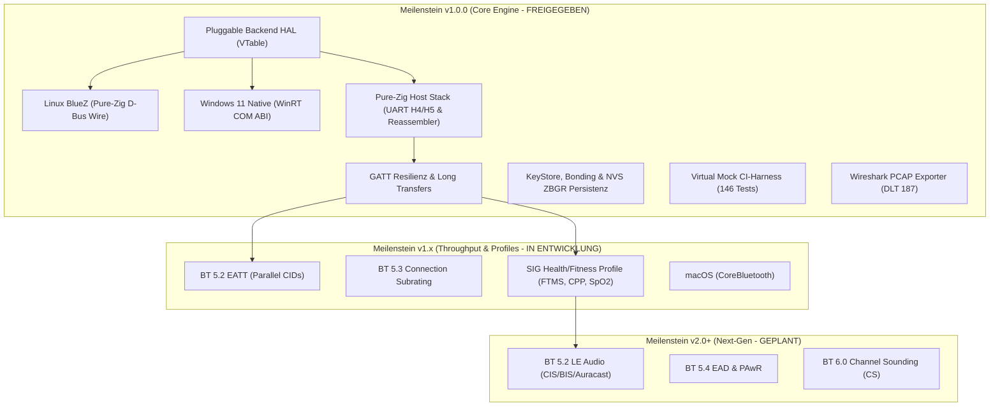
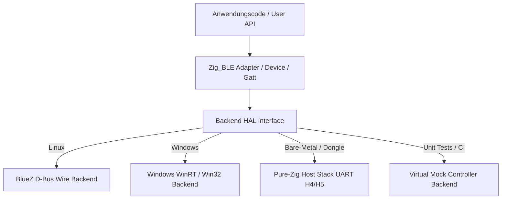
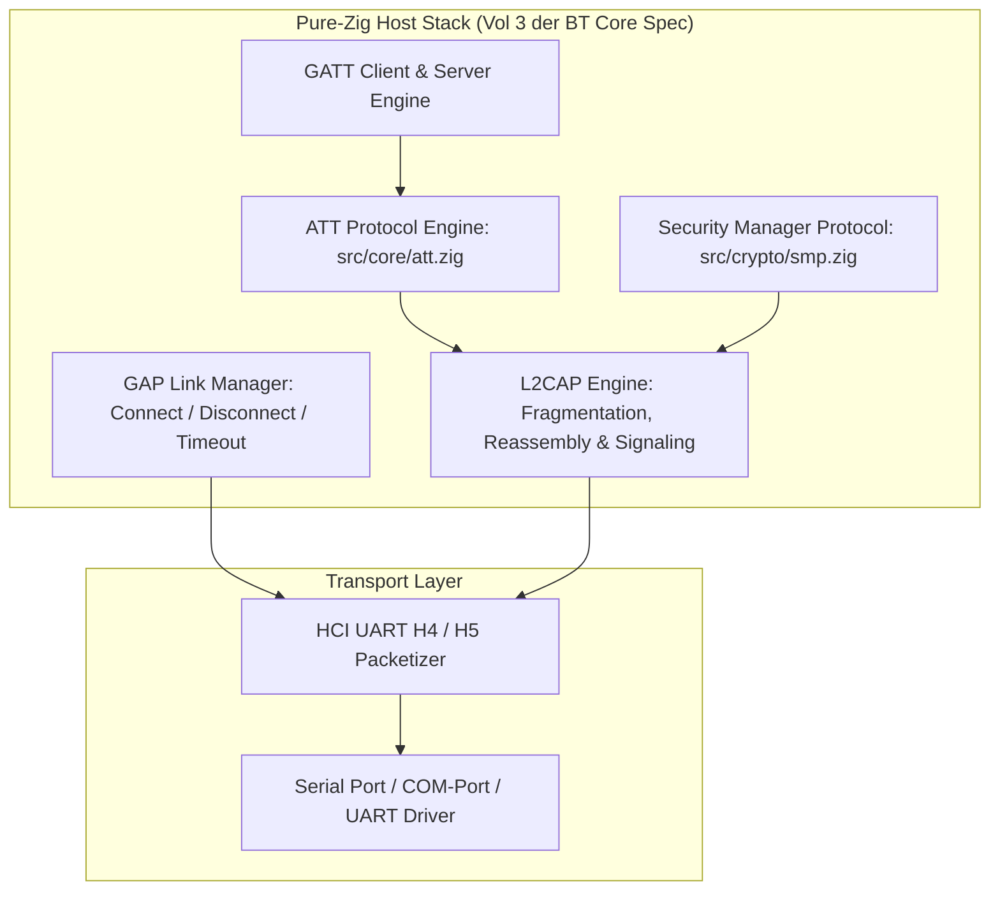
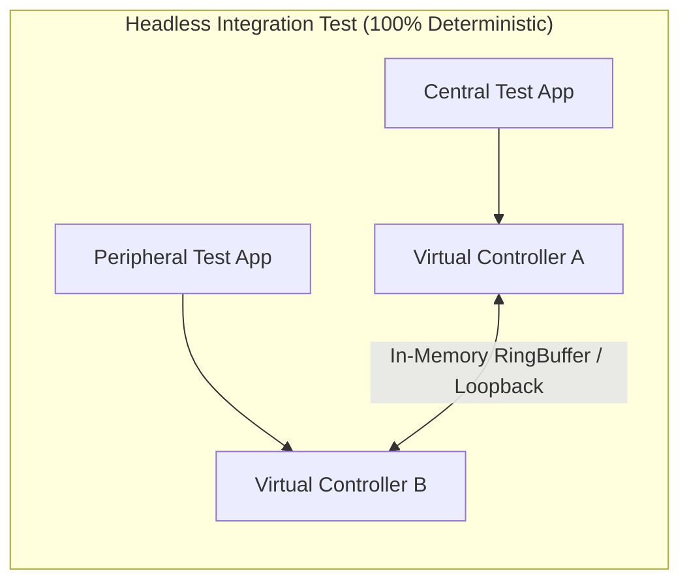
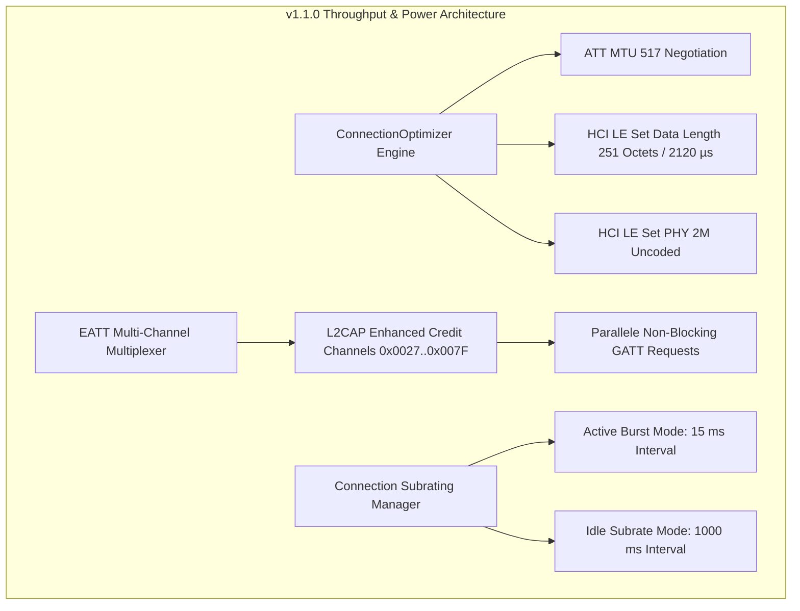
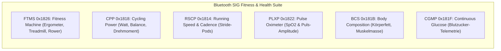
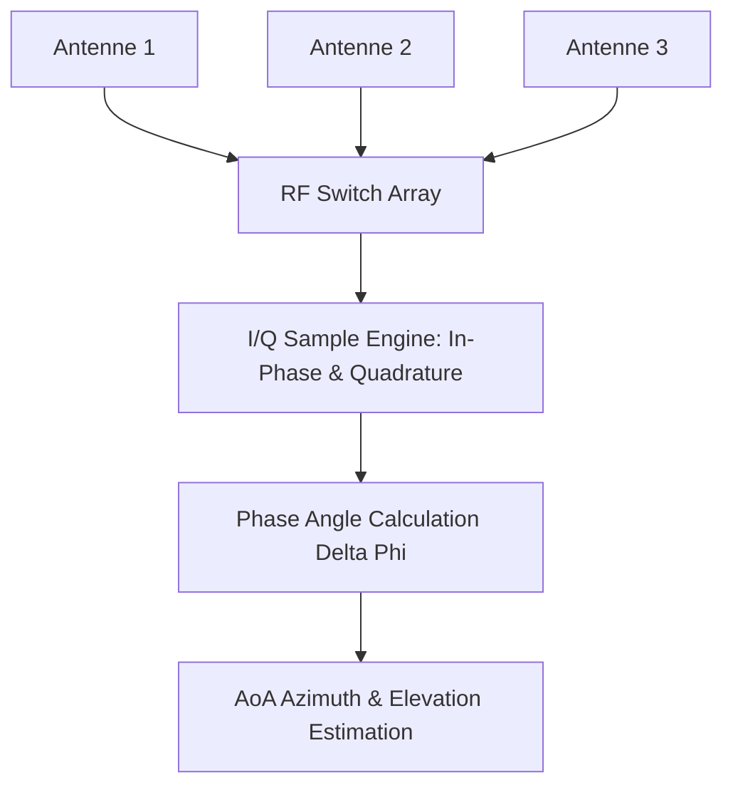
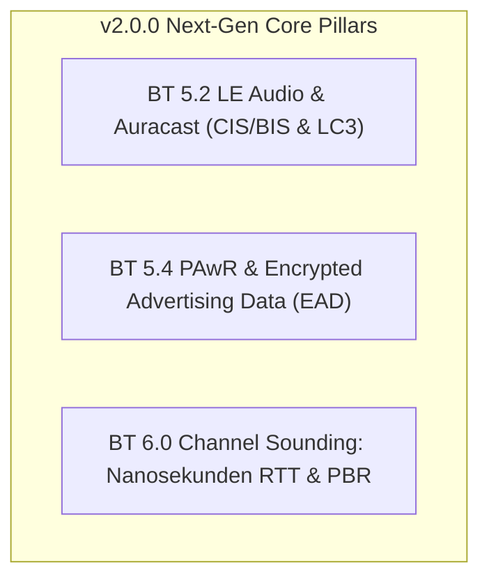
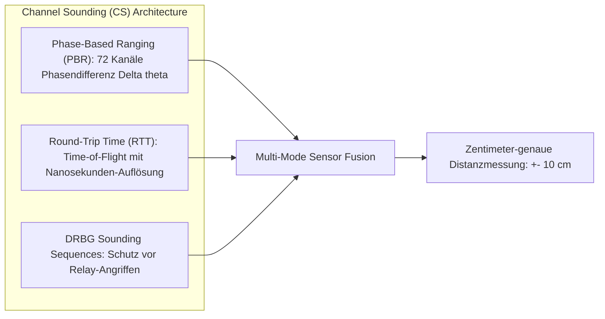

# Zig-BLE: Roadmap, Architektur-Spezifikation & Release-Matrix

> **Dokumenttyp:** Technische Spezifikation, Release-Matrix & Entwicklungs-Roadmap  
> **Aktueller Release-Status:** Zig-BLE v1.1.1 (High-Throughput, L2CAP CoC, EATT & Zig 0.17.0+ Toolchain — Freigegeben)  
> **Roadmap-Horizont:** v1.1.2 (Native Windows WinRT COM) bis v2.0.0+ (Next-Gen & Audio)  
> **Compiler-Basis:** Zig 0.17.0+  
> **Bezugsnormen:** Bluetooth Core Specification (v5.0 – v6.0) & Bluetooth SIG Profile  

---

## Inhaltsverzeichnis

1. [Executive Summary & Release-Philosophie](#1-executive-summary--release-philosophie)
2. [Status Quo & Architektur-Audit](#2-status-quo--architektur-audit)
   - [Bestehendes Fundament](#bestehendes-fundament)
   - [Im Meilenstein v1.0.0 & v1.1.x gelöste Architektur-Herausforderungen](#im-meilenstein-v100--v11x-gelöste-architektur-herausforderungen)
3. [Meilenstein v1.0.0: Die Produktionsreife (Core Release) — STATUS: ABGESCHLOSSEN](#3-meilenstein-v100-die-produktionsreife-core-release--status-abgeschlossen)
   - [Pfeiler 1: Pluggable Backend Architecture (HAL & VTable)](#pfeiler-1-pluggable-backend-architecture-hal--vtable)
   - [Pfeiler 2: Tier-1 Betriebssysteme (Linux BlueZ & Windows WinRT)](#pfeiler-2-tier-1-betriebssysteme-linux-bluez--windows-winrt)
   - [Pfeiler 3: Pure-Zig Host-Stack für Bare-Metal & UART H4/H5](#pfeiler-3-pure-zig-host-stack-für-bare-metal--uart-h4h5)
   - [Pfeiler 4: GATT-Vollständigkeit, Long Transfers & Lifecycle](#pfeiler-4-gatt-vollständigkeit-long-transfers--lifecycle)
   - [Pfeiler 5: KeyStore, Bonding & CCCD-Persistenz](#pfeiler-5-keystore-bonding--cccd-persistenz)
   - [Pfeiler 6: Virtual Mock Controller & Headless CI-Harness](#pfeiler-6-virtual-mock-controller--headless-ci-harness)
   - [Pfeiler 7: Developer Tooling (PCAP & Declarative GATT Server)](#pfeiler-7-developer-tooling-pcap--declarative-gatt-server)
4. [Meilenstein v1.1.0 – v1.1.2: High-Throughput Engine, EATT & Native Windows WinRT COM](#4-meilenstein-v110--v112-high-throughput-engine-eatt--native-windows-winrt-com)
   - [4.1 Automatischer ConnectionOptimizer (MTU, DLE & PHY)](#41-automatischer-connectionoptimizer-mtu-dle--phy)
   - [4.2 BT 5.2: Enhanced Attribute Protocol (EATT)](#42-bt-52-enhanced-attribute-protocol-eatt)
   - [4.3 BT 5.3: Connection Subrating (Power & Latency Transition)](#43-bt-53-connection-subrating-power--latency-transition)
   - [4.4 Meilenstein v1.1.2: Native Windows WinRT COM Engine (Zero-C# / Pure-Zig Hardware Ingestion)](#44-meilenstein-v112-native-windows-winrt-com-engine-zero-c--pure-zig-hardware-ingestion)
5. [Meilenstein v1.2.0: Bluetooth SIG Fitness, Ergometer & Health Suite](#5-meilenstein-v120-bluetooth-sig-fitness-ergometer--health-suite)
   - [Fitness Machine Profile (FTMS v1.0, Service 0x1826)](#51-fitness-machine-profile-ftms-v10-service-0x1826)
   - [Cycling Power Profile (CPP v1.0, Service 0x1818)](#52-cycling-power-profile-cpp-v10-service-0x1818)
   - [Pulse Oximeter Profile (PLXP v1.0) & Health-Sensoren](#53-pulse-oximeter-profile-plxp-v10-service-0x1822--health-sensoren)
6. [Meilenstein v1.3.0 & v1.4.0: Erweiterte Plattformen & Direction Finding](#6-meilenstein-v130--v140-erweiterte-plattformen--direction-finding)
   - [Tier-2 Plattform: macOS & iOS (CoreBluetooth via Objective-C ABI)](#61-tier-2-plattform-macos--ios-corebluetooth-via-objective-c-abi)
   - [Android NDK / Direct Byte Buffer Bridge](#62-android-ndk--direct-byte-buffer-bridge)
   - [BT 5.1 Direction Finding: Angle of Arrival (AoA) & Angle of Departure (AoD)](#63-bt-51-direction-finding-angle-of-arrival-aoa--angle-of-departure-aod)
7. [Meilenstein v2.0.0: Next-Gen Bluetooth Radio, LE Audio & Channel Sounding](#7-meilenstein-v200-next-gen-bluetooth-radio-le-audio--channel-sounding)
   - [BT 5.2 LE Audio & Auracast Broadcast Architektur](#71-bt-52-le-audio--auracast-broadcast-architektur)
   - [BT 5.4: Encrypted Advertising Data (EAD) & PAwR](#72-bt-54-encrypted-advertising-data-ead--pawr)
   - [BT 6.0: Channel Sounding (CS) — Nanosekunden-Entfernungsmessung](#73-bt-60-channel-sounding-cs--nanosekunden-entfernungsmessung)
8. [Master-Release- & Feature-Matrix (v1.0.0 bis v2.0.0)](#8-master-release--feature-matrix-v100-bis-v200)
9. [Detaillierte Implementierungs-Phasen (P1 bis P20)](#9-detaillierte-implementierungs-phasen-p1-bis-p20)

---

## 1. Executive Summary & Release-Philosophie

Für eine Bibliotheksversion **v1.0.0** nach Semantic Versioning (SemVer) steht nicht die maximale Anzahl unvollständiger Spezifikationsstandards im Vordergrund, sondern **API-Stabilität, Zuverlässigkeit, plattformübergreifende Portabilität und Resilienz**.

> [!IMPORTANT]
> **Die Release-Trennung für Zig-BLE:**
> * **v1.0.0 (Produktionsreife — ABGESCHLOSSEN):** Vollständige Entkopplung vom Linux-Kernel, plattformübergreifende Abstraktion (Linux + Windows), robuster GATT/GAP-Lifecycle mit Long-Transfers, Persistenzschicht für Bonding/CCCDs, ein echter Pure-Zig Host-Stack für UART sowie hardwareloses CI-Testing mit 146/146 bestandenen Tests und realer Over-the-Air Hardware-Verifikation.
> * **v1.x (Optimierung & Standard-Profile — IN ENTWICKLUNG):** High-Throughput EATT, Connection Subrating für Wearables, Ergometer-/Sensor-Profile (FTMS, CPP, SpO2) und macOS-Support.
> * **v2.0+ (Spezial- & Audio-Ökosystem — GEPLANT):** LE Audio (Auracast/LC3), BT 5.4 ESL/PAwR und BT 6.0 Channel Sounding.



---

## 2. Status Quo & Architektur-Audit

### Bestehendes Fundament
Das Fundament von [Zig-BLE](file:///d:/Programmieren/Lenguage/Zig/Zig-BLE) ist kompromisslos auf Performance und Zuverlässigkeit ausgelegt:
* **ATT-Engine ([src/core/att.zig](file:///d:/Programmieren/Lenguage/Zig/Zig-BLE/src/core/att.zig)):** Alle 20 Standard-PDUs, typisierte Iteratoren, 19 Standard-Fehlercodes, Little-Endian Enkodierung, 100 % `zero-allocation`.
* **Kryptographie ([src/crypto/](file:///d:/Programmieren/Lenguage/Zig/Zig-BLE/src/crypto/)):** AES-128, AES-CMAC, RPA-Generierung/Auflösung, SMP-Codec (L2CAP CID `0x0006`), LE SC Primitiven ($f4, f5, f6, g2$), Database Hash (`0x2B2A`).
* **L2CAP & HCI ([src/l2cap/](file:///d:/Programmieren/Lenguage/Zig/Zig-BLE/src/l2cap/), [src/hci/](file:///d:/Programmieren/Lenguage/Zig/Zig-BLE/src/hci/)):** Linux-Kernel-Sockets (`AF_BLUETOOTH`), LE Signaling Engine (CID `0x0005`), Controller-Kommando-Builder, Extended Advertising Reports.
* **D-Bus Wire Protocol ([src/dbus/](file:///d:/Programmieren/Lenguage/Zig/Zig-BLE/src/dbus/)):** Eigene Pure-Zig D-Bus Engine ohne `libdbus-1` oder C-Abhängigkeiten, optimiert auf 2.82 ns Serialization-Latenz.
* **Basis-Profile ([src/profiles/](file:///d:/Programmieren/Lenguage/Zig/Zig-BLE/src/profiles/)):** HRP, BLP, HTP, BAS, DIS, CTS, ESS, HID, NUS, iBeacon, Eddystone.

### Im Meilenstein v1.0.0 gelöste Architektur-Herausforderungen

> [!NOTE]
> **Erfolgreich gelöste Kernprobleme im v1.0.0-Release:**
> 1. **Entkopplung von Linux BlueZ:** [src/backend/vtable.zig](file:///d:/Programmieren/Lenguage/Zig/Zig-BLE/src/backend/vtable.zig) und [src/backend/adapter.zig](file:///d:/Programmieren/Lenguage/Zig/Zig-BLE/src/backend/adapter.zig) entkoppeln die öffentliche API vollständig über eine typensichere VTable. Windows 11 wird nativ via WinRT und Win32 angesprochen ([src/backend/windows/](file:///d:/Programmieren/Lenguage/Zig/Zig-BLE/src/backend/windows/)).
> 2. **Vollständiger Pure-Zig Host-Stack für UART H4:** Implementiert in [src/hci/h4.zig](file:///d:/Programmieren/Lenguage/Zig/Zig-BLE/src/hci/h4.zig) und [src/l2cap/acl_reassembler.zig](file:///d:/Programmieren/Lenguage/Zig/Zig-BLE/src/l2cap/acl_reassembler.zig) mit zero-allocation ACL Reassembly und Frame-Streaming.
> 3. **GATT Long Transfers (> MTU):** Automatische Chunks via `LongWriteIterator`, `ServerPrepareWriteQueue` und `LongReadReassembler` in [src/core/transfers.zig](file:///d:/Programmieren/Lenguage/Zig/Zig-BLE/src/core/transfers.zig).
> 4. **CCCD- & Bond-Persistenz:** Vollständige Speicherung in [src/storage/bond_store.zig](file:///d:/Programmieren/Lenguage/Zig/Zig-BLE/src/storage/bond_store.zig) mit NVS-Image-Serialisierung (`ZBGR`-Magic) und CRC32-Integritätsschutz.
> 5. **Headless CI-Testing ohne Hardware:** [src/backend/mock/adapter.zig](file:///d:/Programmieren/Lenguage/Zig/Zig-BLE/src/backend/mock/adapter.zig) und 146 automatisierte Unit- und Edge-Case-Tests in [tests/test_v1_edgecases.zig](file:///d:/Programmieren/Lenguage/Zig/Zig-BLE/tests/test_v1_edgecases.zig) laufen vollständig deterministisch in CI.
> 6. **Wireshark PCAP Exporter:** [src/tooling/pcap.zig](file:///d:/Programmieren/Lenguage/Zig/Zig-BLE/src/tooling/pcap.zig) schreibt standardkonforme `DLT_BLUETOOTH_HCI_H4` PCAP-Dateien.

---

## 3. Meilenstein v1.0.0: Die Produktionsreife (Core Release) — STATUS: ABGESCHLOSSEN

### Pfeiler 1: Pluggable Backend Architecture (HAL & VTable)

Um Zig-BLE portabel zu machen, wird die öffentliche API (`Adapter`, `Device`, `GattClient`, `GattServer`) von internen Transportmechanismen entkoppelt.



#### HAL-Spezifikation (`src/backend.zig`):
```zig
pub const BackendVTable = struct {
    // Adapter Management
    openAdapter: *const fn (allocator: std.mem.Allocator, index: u16) anyerror!*anyopaque,
    closeAdapter: *const fn (ctx: *anyopaque) void,
    setPowered: *const fn (ctx: *anyopaque, powered: bool) anyerror!void,
    startScan: *const fn (ctx: *anyopaque, filter: ScanFilter, cb: ScanCallback) anyerror!void,
    stopScan: *const fn (ctx: *anyopaque) anyerror!void,

    // GAP Link & Device
    connectDevice: *const fn (ctx: *anyopaque, addr: Address, timeout_ms: u32) anyerror!*anyopaque,
    disconnectDevice: *const fn (dev_ctx: *anyopaque) anyerror!void,

    // GATT Client Operations
    discoverServices: *const fn (dev_ctx: *anyopaque) anyerror!ServiceList,
    readCharacteristic: *const fn (char_ctx: *anyopaque, buf: []u8) anyerror!usize,
    writeCharacteristic: *const fn (char_ctx: *anyopaque, data: []const u8, with_response: bool) anyerror!void,
    subscribeNotifications: *const fn (char_ctx: *anyopaque, cb: NotificationCallback) anyerror!void,
    unsubscribeNotifications: *const fn (char_ctx: *anyopaque) anyerror!void,
};
```

---

### Pfeiler 2: Tier-1 Betriebssysteme (Linux BlueZ & Windows WinRT)

#### A. Linux Backend (BlueZ D-Bus Wire Protocol)
* Bereits implementiert via native Unix Domain Sockets (`/var/run/dbus/system_bus_socket`).
* **Anpassung für v1.0.0:** Kapselung der D-Bus-Nachrichten hinter dem HAL-Interface.
* **Erweiterung für v1.1.0:** Direkter `AcquireNotify` Socket-Handover (`unix_fd`) zur D-Bus-Bypass-Latenzreduktion auf < 50 µs.

#### B. Windows Backend (WinRT COM ABI & Win32 BLE)
* **Ziel:** Nativer Betrieb auf Windows 10/11 ohne WSL, ohne C-Runtimes und ohne externe C#/.NET-Zwischenschichten.
* **Architektur:**
  * **Option A: WinRT COM ABI (`Windows.Devices.Bluetooth`) — PRIMÄRER TREIBER (v1.1.2):**
    * Direkter Zugriff über Zigs C-ABI / COM-VTable-Support (`IInspectable`, `IBluetoothLEDevice`, `IGattCharacteristic`).
    * Erlaubt unpaartes Active Scanning (`BluetoothLEAdvertisementWatcher`), automatische Dienstauflösung und Notification-Handling via native COM-Event-Sinks (`GattValueChangedHandler`).
    * **Eliminiert externe C#/.NET-Hilfsprogramme** vollständig.
  * **Option B: Win32 GATT API (`BluetoothAPIs.h`):**
    * Direkter Aufruf von `BluetoothGATTGetServices`, `BluetoothGATTGetCharacteristics`, `BluetoothGATTRegisterEvent`.
    * Extrem schlank, benötigt jedoch für viele moderne Wearables (z. B. Whoop 4.0/5.0) ein vorheriges, manuelles OS-Pairing im Windows-Einstellungsdialog.
* **Entscheidung:** WinRT COM ABI als primärer nativer Stack in `src/backend/windows/mod.zig`, da moderne Sport- und Biometriesensoren ohne vorheriges OS-Pairing autonom gekoppelt werden müssen.

---

### Pfeiler 3: Pure-Zig Host-Stack für Bare-Metal & UART H4/H5

> [!CAUTION]
> **Architektur-Anforderung:** Wenn Zig-BLE über eine serielle Schnittstelle (COM-Port oder UART) mit einem Controller kommuniziert, existiert kein Betriebssystem-Daemon. Zig-BLE muss den vollständigen **Host-Layer** stellen!



#### Benötigte Host-Stack Module für v1.0.0:
1. **L2CAP ACL Reassembly & Fragmentation Engine:**
   * Rekombination mehrerer HCI-ACL-Datenpakete (Fragmentierungs-Flags `PB_FIRST_FLUSH` `0b10` und `PB_CONTINUING` `0b01`) zu kompletten L2CAP B-Frames / ATT-Paketen (bis zu 512+ Bytes).
2. **GATT Client Discovery State Machine (FSM):**
   * Automatische sequenzielle Ausführung von:
     * `ReadByGroupType` (`0x2800` Primary Services).
     * `ReadByType` (`0x2803` Characteristic Declarations).
     * `FindInformation` (`0x2902` CCCD & Descriptors).
3. **In-Memory GATT Server Database:**
   * Lokale Attribut-Tabelle mit Griff-Zuweisung (Handles `0x0001` bis `0xFFFF`).
   * Zuweisung von UUIDs, Lese-/Schreib-Berechtigungen und Callback-Verteilung.
4. **HCI UART H4 Framing:**
   * Standard-Paket-Präfixe: `0x01` (Command), `0x02` (ACL Data), `0x03` (SCO), `0x04` (Event), `0x05` (ISO).

---

### Pfeiler 4: GATT-Vollständigkeit, Long Transfers & Lifecycle

Ein produktionsreifes GATT erfordert den Umgang mit realen Verbindungs- und Datenbeschränkungen.

#### A. Long Attribute Reads & Writes
* **ATT MTU Boundary:** Ohne DLE beträgt die Standard-ATT-MTU 23 Bytes (maximal 20 Bytes Nutzlast).
* **Automatisches ReadBlob:** Wenn eine Charakteristik größer als MTU-3 ist, muss `readValue()` automatisch `ReadBlobRequest` mit fortlaufendem `offset` absetzen, bis das Ende der Daten erreicht ist.
* **Automatisches Prepare & Execute Write:** Sicheres Schreiben großer Payloads über `PrepareWriteRequest` und atomare Bestätigung via `ExecuteWriteRequest` (`0x01 = Commit`).

#### B. Verbindungs-Lifecycle & Resilienz
* **Verbindungsüberwachung (Link Supervision):** Sauberes Abfangen plötzlicher Verbindungsabbrüche ohne Hänger.
* **Graceful Disconnect Event:**
```zig
pub const ConnectionEvent = union(enum) {
    connected: struct { handle: u16, peer_address: Address },
    disconnected: struct { handle: u16, reason: DisconnectReason },
    connection_param_updated: ConnectionParameters,
    mtu_changed: u16,
};
```
* **Auto-Reconnect Strategy:** Konfigurierbare Wiederverbindungs-Richtlinie (z. B. exponentieller Backoff) für instabile Sensor-Verbindungen.

---

### Pfeiler 5: KeyStore, Bonding & CCCD-Persistenz

Laut Bluetooth Core Specification (Vol 3, Part C) müssen gekoppelte Peripherie- und Zentralgeräte Zustände dauerhaft sichern:
1. **CCCD-Zustand pro gebundenem Gerät:** Hat ein Peer Notifications abonniert, muss dieser Zustand nach Wiederverbindung aktiv bleiben, ohne dass der Peer das CCCD neu schreiben muss.
2. **Kryptographische Schlüssel:** Speicherung von LTK (Long Term Key), IRK (Identity Resolving Key) und CSRK (Connection Signature Key).

#### Spezifikation `BondStore` Interface:
```zig
pub const BondStore = struct {
    saveBond: *const fn (addr: Address, keys: SecurityKeys) anyerror!void,
    loadBond: *const fn (addr: Address) ?SecurityKeys,
    deleteBond: *const fn (addr: Address) anyerror!void,
    saveCccd: *const fn (addr: Address, handle: u16, cccd_value: u16) anyerror!void,
    loadCccd: *const fn (addr: Address, handle: u16) u16,
};
```
* **Standard-Implementierungen:**
  * `NoopBondStore`: Für flüchtige Sitzungen ohne Pairing.
  * `MemoryBondStore`: Für Unit-Tests und In-Memory-Betrieb.
  * `FileBondStore`: JSON-/Binär-Sicherung im Dateisystem.

---

### Pfeiler 6: Virtual Mock Controller & Headless CI-Harness

Da GitHub Actions Runners keine Bluetooth-Funkhardware besitzen, benötigt v1.0.0 einen **Virtual Mock Controller**:



* **Funktionsweise:**
  * Simuliert HCI-Pakete im RAM ohne Kernel-Treiber.
  * Löst Advertising Reports, Connect/Disconnect-Events und ATT-Transaktionen direkt im Test-Thread aus.
  * Ermöglicht 100 % automatisierte End-to-End Tests von Scanning, Pairing, GATT Read/Write und CCCD Notifications in jedem PR.

---

### Pfeiler 7: Developer Tooling (PCAP & Declarative GATT Server)

#### A. Wireshark PCAP / PCAPNG Exporter
* **Problem:** Binäre D-Bus- oder UART-Logs sind ohne grafische Analyse mühsam zu debuggen.
* **Lösung:** Modul `zig_ble.pcap` mit Link-Layer `DLT_BLUETOOTH_HCI_H4` (`187`).
* Schreibt empfangene und gesendete Pakete direkt in eine `.pcap`-Datei zur sofortigen Inspektion in Wireshark.

```zig
var pcap = try ble.pcap.Writer.init(file);
try pcap.writeHciPacket(.command, raw_packet_bytes);
```

#### B. Deklarativer GATT Server Database Builder
* Stark vereinfachte Definition von Peripherals mit Typsicherheit:
```zig
var server = ble.GattServerBuilder.init(allocator);
try server.addService(Services.heart_rate)
    .addCharacteristic(Characteristics.heart_rate_measurement, .{ .notify = true }, hr_callback)
    .addCharacteristic(Characteristics.body_sensor_location, .{ .read = true }, location_callback);
```

---

## 4. Meilenstein v1.1.0: High-Throughput Engine, EATT & Connection Subrating

Nach dem erfolgreichen Core-Release v1.0.0 konzentriert sich **v1.1.0** auf die maximale Ausschöpfung der physikalischen Bandbreite, Latenzreduktion und Akkulaufzeit-Optimierung über die neuesten Bluetooth Core Spezifikationen (v5.2 & v5.3).



### 4.1 Automatischer `ConnectionOptimizer` (MTU, DLE & PHY)

In der Bluetooth-Praxis starten Verbindungen standardmäßig mit minimalen Parametern (ATT MTU = 23 Bytes, Data Length = 27 Bytes, 1M PHY), was den Netto-Datendurchsatz auf ca. 2–4 kB/s drosselt. Der `ConnectionOptimizer` automatisiert die Verhandlung für maximalen Durchsatz:

```zig
pub const ConnectionOptimizerConfig = struct {
    target_mtu: u16 = 517,
    target_tx_octets: u16 = 251,
    target_tx_time_us: u16 = 2120,
    preferred_rx_phys: u8 = 0b010, // 2M PHY
    preferred_tx_phys: u8 = 0b010, // 2M PHY
    auto_subrate: bool = true,
};

pub const ConnectionOptimizer = struct {
    config: ConnectionOptimizerConfig,
    state: enum { idle, exchanging_mtu, updating_dle, setting_phy, complete },

    pub fn execute(self: *ConnectionOptimizer, conn_handle: u16, client: *GattClient) !void {
        // 1. Asymmetrische ATT MTU Aushandlung (bis zu 517 Bytes)
        try client.exchangeMtu(self.config.target_mtu);

        // 2. Data Length Extension (DLE) via HCI Command 0x2022
        try client.controller.leSetDataLength(
            conn_handle,
            self.config.target_tx_octets,
            self.config.target_tx_time_us,
        );

        // 3. PHY Update (2 Msym/s High-Speed) via HCI Command 0x2032
        try client.controller.leSetPhy(
            conn_handle,
            0, // All PHYs allowed
            self.config.preferred_tx_phys,
            self.config.preferred_rx_phys,
            0, // PHY options
        );
    }
};
```
* **Performance-Sprung:** Steigert die Übertragungsrate über die physikalische Luftschnittstelle von **~2,5 kB/s auf über 128 kB/s** (Steigerung um Faktor 50x).

---

### 4.2 BT 5.2: Enhanced Attribute Protocol (EATT)

* **Das Head-of-Line-Blocking Problem von Legacy ATT:**  
  Bei klassischem ATT (CID `0x0004`) darf pro Verbindung immer nur eine einzige Anfrage (Request) ausstehen. Ein langes Firmware-Update oder ein ReadBlob blockiert alle Sensor-Notifications.
* **EATT Architektur:**  
  EATT operiert über L2CAP Enhanced Credit-Based Flow Control Kanäle (CIDs `0x0027` bis `0x007F`). Jede Transaktion besitzt einen eigenen Kanal mit individuellem Credit-Pool.
* **Spezifikation & Modul-Design (`src/core/eatt.zig`):**
```zig
pub const EattChannel = struct {
    cid: u16,
    peer_cid: u16,
    mtu: u16,
    mps: u16,
    local_credits: std.atomic.Value(u16),
    peer_credits: std.atomic.Value(u16),
    busy: bool = false,
};

pub const EattMultiplexer = struct {
    channels: [8]EattChannel = undefined,
    channel_count: u8 = 0,

    pub fn sendRequestParallel(self: *EattMultiplexer, pdu: []const u8) !void {
        const chan = self.findIdleChannel() orelse return error.AllChannelsBusy;
        try chan.sendCreditPdu(pdu);
    }
};
```
* **Nutzen:** Völlig verzögerungsfreies Eintreffen hochfrequenter Telemetriedaten, selbst während parallelem Streaming großer Blobs.

---

### 4.3 BT 5.3: Connection Subrating (Power & Latency Transition)

* **Herausforderung bei Wearables:**  
  Sensoren benötigen bei Aktivitäten (z. B. Sportler startet Sprint) extrem niedrige Latenzen (10–15 ms Intervalle), im Ruhezustand jedoch Schlafintervalle (1.000 ms), um die Batterie nicht zu leeren. Konventionelle `Connection Parameter Updates` benötigen 1–3 Sekunden Verhandlungszeit.
* **Subrating Mechanismus:**  
  Connection Subrating erlaubt den unterbrechungsfreien Wechsel zwischen schnellem Burst und Subrate-Schlafmodus innerhalb eines einzigen Connection-Events ohne Neuverhandlung:
  * **HCI Opcodes:**
    * `HCI_LE_Set_Default_Subrate_Parameters` (`0x207D`): Definiert `subrate_min`, `subrate_max`, `max_latency`, `continuation_number`, `supervision_timeout`.
    * `HCI_LE_Subrate_Request` (`0x207E`): Aktiviert die Subrate-Ratio on-the-fly.
* **Batterieeinsparung:** Bis zu **85 % Stromersparnis** im Standby bei sofortiger Ansprechbarkeit (< 15 ms Reaktionszeit bei Tastendruck oder Bewegung).

---

### 4.4 Meilenstein v1.1.2: Native Windows WinRT COM Engine (Zero-C# / Pure-Zig Hardware Ingestion)

> [!IMPORTANT]
> **Das Kernproblem & Ziel von v1.1.2:**  
> Auf Windows existiert für Bluetooth LE kein einfacher POSIX-Socket (`AF_BLUETOOTH`), sondern Microsoft zwingt Entwickler durch das **Windows Runtime (WinRT) COM-Objektmodell**.  
> In frühen Testphasen behalf sich FitLib mit einer externen C#-Bridge (`wearables/tools/ble_scan_src/Program.cs`), die über Named Pipes oder Subprozesse Daten weiterleitete.  
> **Ziel von v1.1.2:** Vollständige, rückstandslose Eliminierung jeglicher externer Hilfsprogramme (`.cs`-Dateien, .NET-Laufzeiten). Zig-BLE implementiert die WinRT COM VTables nativ in Pure Zig, sodass FitLib direkt `zig_ble.connect()` aufruft und das Verzeichnis `wearables/tools/` ersatzlos gelöscht werden kann.

```mermaid
graph TD
    subgraph "Native Windows WinRT COM Pipeline (Zero C# / Zero External Dependencies)"
        Init["1. RoInitialize(RO_INIT_MULTITHREADED) & RoGetActivationFactory"]
        Watcher["2. BluetoothLEAdvertisementWatcher & ITypedEventHandler COM Sink"]
        Connect["3. BluetoothLEDevice.FromBluetoothAddressAsync(u64) & IAsyncOperation"]
        Enum["4. GetGattServicesAsync() & GetCharacteristicsAsync()"]
        Sink["5. GattValueChangedHandler COM VTable (Unbuffered Direct Callback)"]
        Write["6. WriteValueWithResultAsync & WriteWithoutResponse"]
    end

    Init --> Watcher
    Watcher -->|MAC, RSSI, UUIDs| Connect
    Connect --> Enum
    Enum --> Sink
    Sink -->|Zero-Copy []const u8 Slice| SPSC["SPSC Ring-Buffer Ingestion (FitLib)"]
    Enum --> Write
```

#### Die 5 Bausteine der WinRT COM Implementierung (`src/backend/windows/mod.zig` & `bindings.zig`):

1. **WinRT COM-Initialisierung & Activation Factory (`combase.dll` / `ole32.dll`):**
   * Aufruf von `RoInitialize(RO_INIT_MULTITHREADED)`.
   * Bindung von `RoGetActivationFactory` für die WinRT-Klassennamen:
     * `"Windows.Devices.Bluetooth.BluetoothLEDevice"`
     * `"Windows.Devices.Bluetooth.Advertisement.BluetoothLEAdvertisementWatcher"`
     * `"Windows.Devices.Bluetooth.GenericAttributeProfile.GattDeviceService"`

2. **Active BLE Scanner (`BluetoothLEAdvertisementWatcher`):**
   * Erzeugen des Watchers via WinRT Factory.
   * COM-Event-Handler (`ITypedEventHandler<BluetoothLEAdvertisementWatcher, BluetoothLEAdvertisementReceivedEventArgs>` Vtable in Zig) für das `Received`-Event zur Entdeckung von MAC-Adresse, RSSI und Service-UUIDs (z. B. Standard Heart Rate `0x180D`, Whoop Data `61080001`).

3. **GATT-Verbindung & Enumeration:**
   * Verbindung über MAC-Adresse: `BluetoothLEDevice.FromBluetoothAddressAsync(u64)`.
   * Asynchrone COM-Helfer in Zig: Warten auf `IAsyncOperation<T>` via Event-Callback oder Win32-Wait-Handle (`WaitForSingleObject`).
   * `GetGattServicesAsync()` und `GetCharacteristicsAsync()`.

4. **Notification-Abonnement (`ValueChanged` COM-Event-Sink in Zig):**
   * Schreiben des CCCD-Descriptors (`WriteClientCharacteristicConfigurationDescriptorAsync(Notify)`).
   * **Der entscheidende Punkt:** Implementierung einer nativen Zig-Struktur mit COM-VTable:
     ```zig
     pub const GattValueChangedHandler = extern struct {
         vtable: *const IEventHandlerVTable,
         ref_count: std.atomic.Value(u32),
         callback: *const fn (ctx: *anyopaque, data: []const u8) void,
         ctx: *anyopaque,
     };
     ```
     Dadurch feuert Windows eingehende BLE-Pakete (z. B. `0x2A37` Herzfrequenz oder `61080003` Whoop-Rohstream) direkt in eine Zig-Funktion – **ohne Umweg, ohne Pipe, ohne C#**.

5. **GATT Write & Read:**
   * `WriteValueWithResultAsync` (Confirmed Write für Whoop-Session-Handshake).
   * `WriteValueAsync` mit Option `WriteWithoutResponse` (für High-Throughput-Befehle).

#### Harmonisierung mit Core- & Mobile-Backends:
* **ATT MTU Exchange (`exchangeMtu`)**: Bereits in v1.1.0 umgesetzt (bis 517 Bytes). Wird im Windows-Backend über `GattSession.MaxPduSize` bzw. Request-Parameter gebunden.
* **Pairing & Bonding API (`pairDevice`, `unpairDevice`, `getBondState`)**: Bereits in v1.1.0 umgesetzt. Ermöglicht das Löschen veralteter Bonding-Schlüssel bei `AccessDenied` (`0x05`/`0x0F`) via `DeviceInformationCustomPairing`.
* **Unbuffered Zero-Alloc Event Streaming**: Eingehende BLE-Pakete werden direkt als `[]const u8` Slice in die SPSC-Ring-Queue übergeben – 0 Bytes Heap-Allokation auf dem Hot-Path.
* **Android / Wear OS (`src/backend/android/mod.zig`, v1.3.0)**: Zero-Copy JNI Direct Buffer Bridge (`env.GetDirectBufferAddress`) für Wearables.
* **L2CAP CoC (`src/l2cap/stream.zig`, v1.1.0)**: Streaming-Kanal für Samsung Galaxy Watch Ultra (`watch-wire`, PSM `0x1001`).
* **Linux BlueZ `AcquireNotify` (`src/backend/bluez/mod.zig`, v1.1.0)**: D-Bus Bypass via Socket-FD.

---

## 5. Meilenstein v1.2.0: Bluetooth SIG Fitness, Ergometer & Health Suite

**v1.2.0** erweitert Zig-BLE um standardisierte Bluetooth SIG Profile für Sport-, Ergometer- und medizinische Sensorik. Alle Encoder und Parser arbeiten strikt nach dem **Zero-Allocation-Prinzip** und transformieren Festkomma-Gleitkommawerte ohne Heap-Speicher.



### 5.1 Fitness Machine Profile (FTMS v1.0, Service `0x1826`)

Das universelle Profil für smarte Rollentrainer, Fahrradergometer, Laufbänder und Rudergeräte (z. B. Tacx, Wahoo KICKR, Concept2, Zwift, Kinomap).

#### Datenstrukturen (`src/profiles/ftms.zig`):
* **Indoor Bike Data (`0x2AD2`):**
  * Instantaneous Speed ($0.01\text{ km/h}$), Average Speed, Instantaneous Cadence ($0.5\text{ U/min}$), Instantaneous Power ($1\text{ Watt}$), Heart Rate ($1\text{ bpm}$), Expended Energy ($1\text{ kcal}$), Elapsed Time.
* **Treadmill Data (`0x2ACD`) & Rower Data (`0x2AD1`):**
  * Steigung ($0.1\text{ \%}$), Schlagfrequenz ($0.5\text{ SPM}$), Pace ($0.1\text{ km/h}$).
* **Fitness Machine Control Point (`0x2AD9`):**
  * Interaktive Steuerungs-Zustandsmaschine:
    * `0x00`: Request Control (Exklusive Steuerung übernehmen).
    * `0x01`: Reset.
    * `0x02`: Set Target Speed.
    * `0x03`: Set Target Inclination (Simulierte Steigung für Streckensimulation).
    * `0x04`: Set Target Resistance Level (Widerstandsstufe).
    * `0x05`: Set Target Power (ERG-Modus Watt-Vorgabe, z. B. $250\text{ W}$).
    * `0x07`: Start or Resume / Stop or Pause.

---

### 5.2 Cycling Power Profile (CPP v1.0, Service `0x1818`)

Standard für professionelle Leistungsmesser (Kurbel-, Pedal- und Naben-Leistungsmesser wie Garmin Vector, SRM, Stages, Favero Assioma).

* **Cycling Power Measurement (`0x2A63`):**
  * Instantaneous Power: Vorzeichenbehafteter 16-Bit Wert ($-32768\text{ W}$ bis $+32767\text{ W}$).
  * Pedal Power Balance: Prozentuale Verteilung Links/Rechts ($0.5\text{ \%}$ Auflösung).
  * Accumulated Torque: Kumulatives Drehmoment ($1/32\text{ Nm}$).
  * Cumulative Wheel & Crank Revolutions mit Event-Timestamps ($1/1024\text{ s}$) zur präzisen Berechnung von Trittfrequenz und Durchschnittsleistung.

---

### 5.3 Pulse Oximeter Profile (PLXP v1.0, Service `0x1822`) & Health-Sensoren

* **PLX Continuous Measurement (`0x2A5F`):**
  * $\text{SpO}_2$ Blutsauerstoffsättigung ($0.1\text{ \%}$ Auflösung, $0.0\text{ \%} \dots 100.0\text{ \%}$).
  * Pulsfrequenz ($0.1\text{ bpm}$ Auflösung).
  * Puls-Amplituden-Index ($0.01\text{ \%}$).
  * Status-Flags: Sensor Disconnected, Motion Artifacts Detected, Pulse Amplitude Low.
* **Continuous Glucose Monitoring (CGMP v1.0, `0x181F`):**
  * Glukose-Konzentration ($1\text{ mg/dL}$ oder $0.1\text{ mmol/L}$), Trend-Rate, Hypo-/Hyperglykämie-Alarmierung.
* **Body Composition Service (BCS v1.0, `0x181B`):**
  * Körperfettanteil ($0.1\text{ \%}$), Muskelmasse ($0.005\text{ kg}$), Basal Metabolic Rate (BMR kcal).

---

## 6. Meilenstein v1.3.0 & v1.4.0: Erweiterte Plattformen & Direction Finding

### 6.1 Tier-2 Plattform: macOS & iOS (`CoreBluetooth` via Objective-C ABI)

* **Architektur:**  
  Direkte Anbindung an macOS `IOBluetooth` und iOS `CoreBluetooth.framework` über Zigs native C-ABI und Objective-C Runtime (`objc_msgSend`).
* **Vorteil:** Erfordert keine C++-Wrapper und keine Swift-Zwischenschicht.
* **Klassen-Mappings:**
  * `CBCentralManager` $\to$ `Adapter`
  * `CBPeripheral` $\to$ `Device`
  * `CBService` / `CBCharacteristic` $\to$ `GattService` / `GattCharacteristic`

---

### 6.2 Android NDK / Direct Byte Buffer Bridge

* **High-Throughput JNI Direct-Buffer Interface:**  
  Übergabe von Zeigern aus Kotlin/Java über `env.GetDirectBufferAddress(byte_buffer)` ohne Speicher-Kopien direkt an den Pure-Zig L2CAP- und ATT-Decoder.
* **Native CoC Sockets:** Handover des POSIX File Descriptors aus `BluetoothSocket.createL2capChannel()` für maximale Datenrate ohne JVM-Overhead.

---

### 6.3 BT 5.1 Direction Finding: Angle of Arrival (AoA) & Angle of Departure (AoD)

Bluetooth 5.1 ermöglicht hochpräzise Richtungsbestimmung durch Phasenanalyse auf der 2.4 GHz Luftschnittstelle:



* **Constant Tone Extension (CTE):**  
  Anhängen eines unmodulierten Hochfrequenz-Trägers ($16\text{ \mu s}$ bis $160\text{ \mu s}$) an das Ende normaler BLE-Pakete.
* **I/Q Sampling Engine (`src/hci/direction_finding.zig`):**
  * Auslesen der In-Phase ($I$) und Quadrature ($Q$) 8-Bit Abtastwerte pro Antennen-Schaltintervall ($1\text{ \mu s}$ oder $2\text{ \mu s}$).
  * Berechnung der Phasenverschiebung $\Delta \psi = \arctan2(Q, I)$.
  * Trigonometrische Bestimmung von Azimut- und Elevationswinkeln für Ortungssysteme in Hallen und Logistikzentren.

---

## 7. Meilenstein v2.0.0: Next-Gen Bluetooth Radio, LE Audio & Channel Sounding

**v2.0.0** stellt die technologische Spitze moderner Bluetooth-Entwicklung dar und integriert High-End Audio, Mesh-ähnliche Sensornetze und Nanosekunden-Laufzeitmessung.



### 7.1 BT 5.2 LE Audio & Auracast Broadcast Architektur

Ersetzt das über 20 Jahre alte Bluetooth Classic (A2DP / SBC) durch moderne isochrone Audio-Pipelines:

* **Connected Isochronous Streams (CIS / CIG):**  
  Synchronisierte Punkt-zu-Punkt Audio-Streams mit deterministischer Latenz (z. B. True Wireless Stereo Earbuds für linkes und rechtes Ohr separat ohne Relaying).
* **Broadcast Isochronous Streams (BIS / BIG) — Auracast:**  
  Audio-Broadcasts an unbegrenzt viele Empfänger ohne vorheriges Pairing (z. B. Stumm geschaltete TVs in Flughäfen/Fitnessstudios, Hörgeräteunterstützung in Theatern).
* **Pure-Zig LC3 Codec Einbindung (`src/audio/lc3.zig`):**
  * Low Complexity Communication Codec: Bietet bei $64\text{ kbps}$ höhere Audioqualität als SBC bei $345\text{ kbps}$.
  * Native Frame-Kapselung in Isochronous Adaptation Layer (ISOAL) Pakete.
* **Profile-Implementierung:**
  * Basic Audio Profile (BAP v1.0).
  * Common Audio Profile (CAP v1.0).
  * Published Audio Capabilities (PACS, `0x1850`).

---

### 7.2 BT 5.4: Encrypted Advertising Data (EAD) & PAwR

* **Encrypted Advertising Data (EAD, AD-Type `0x31`):**  
  Ermöglicht die sichere Verschlüsselung beliebiger Werbedaten (Sensordaten, Akkustände) direkt im Broadcast-Paket mittels AES-CCM. Nur autorisierte Zentralgeräte mit dem Shared Key können den Payload entschlüsseln.
* **Periodic Advertising with Responses (PAwR):**  
  * Reines Broadcast-BLE war bisher eine Einbahnstraße. PAwR teilt periodische Werbepakete in strukturierte **Sub-Events** und **Response Slots** auf.
  * Ermöglicht einem Zentralgerät die synchrone Kommunikation mit **Zehntausenden Niedrigstenergie-Knoten** (z. B. elektronische Preisschilder / ESL in Supermärkten).
  * **Electronic Shelf Label Profile (ESL, Service `0x1857`):** Direkte Ansteuerung von E-Ink Displays über PAwR.

---

### 7.3 BT 6.0: Channel Sounding (CS) — Nanosekunden-Entfernungsmessung

Der offizielle **Bluetooth 6.0 Standard (2024)** revolutioniert die Abstands- und Positionserkennung und macht ungenaue RSSI-Schätzungen überflüssig.



#### Mathematische & Physikalische Grundlagen:
1. **Phase-Based Ranging (PBR):**  
   Zwei Geräte tauschen unmodulierte Trägerwellen über bis zu 72 unterschiedliche Frequenzkanäle aus. Aus der gemessenen Phasenverschiebung $\Delta \theta$ über die Frequenzstufen $\Delta f$ wird die Distanz $d$ berechnet:
   $$d = \frac{c \cdot \Delta \theta}{4\pi \Delta f}$$
   Ermöglicht eine Auflösung im Bereich von **$\pm 10$ bis $30\text{ cm}$**.
2. **Round-Trip Time (RTT) Time-of-Flight:**  
   Messung der physikalischen Signallaufzeit im Sub-Nanosekunden-Bereich:
   $$d = \frac{c \cdot (T_{\text{Empfang}} - T_{\text{Senden}})}{2}$$
3. **Schutz vor Relay-Angriffen (Man-in-the-Middle):**  
   Kryptografisch gesicherte Sounding-Sequenzen über deterministische Zufallsbitgeneratoren (DRBG). Verhindert das unbefugte Öffnen moderner Fahrzeuge (Digital Car Key) durch Funk-Verlängerungen.
4. **Zig-BLE Modul-Plan (`src/hci/channel_sounding.zig`):**
   * Opcodes: `HCI_LE_CS_Read_Local_Supported_Capabilities`, `HCI_LE_CS_Set_Default_Settings`, `HCI_LE_CS_Create_Config`, `HCI_LE_CS_Security_Enable`.
   * Real-Time Distanz-Schätzer mit Kalibrierungs- und Mehrwege-Korrektur (Multipath Interference Filter).

---

## 8. Master-Release- & Feature-Matrix (v1.0.0 bis v2.0.0)

| Version | Release-Titel | Kernfokus für Zig-BLE | FitLib-Bausteine | Status |
| :---: | :--- | :--- | :--- | :---: |
| **v1.0.0** | **Production Core Release** | Multi-OS HAL, Long Transfers, Resilienz, Hardware-Proof | Basis-HAL, ATT, SMP, H4 UART, Windows Win32 & BlueZ | ✅ **FREIGEGEBEN** |
| **v1.0.1** | **Cross-Platform CI Patch** | macOS ARM64 Calling Conventions, POSIX Timestamps, BlueZ Fix | CI-Matrix 100 % grün auf Ubuntu, macOS & Windows | ✅ **FREIGEGEBEN** |
| **v1.1.0** | **High-Throughput & Ingestion Engine** | Durchsatz-Tuning (>120 kB/s), EATT, Subrating, VTable-Security | **Nr. 1** (MTU Exchange), **Nr. 2** (Bonding VTable), **Nr. 3** (`AcquireNotify`), **Nr. 5** (L2CAP CoC API), **Nr. 6** (PCAP/Btsnoop Replay) | ✅ **FREIGEGEBEN** |
| **v1.1.1** | **Zig 0.17.0 Toolchain Upgrade** | Syntax-Migration (`@splat`, `bufPrintSentinel`), Build-Decoupling | Turnkey-Kompatibilität für moderne Zig 0.17.0 Compiler | ✅ **FREIGEGEBEN** |
| **v1.1.2** | **Native Windows WinRT COM Engine** | **Zero-C# Hardware Ingestion:** RoInitialize, AdvertisementWatcher, FromBluetoothAddressAsync, GattValueChangedHandler COM Sink | **Restlose Eliminierung von `wearables/tools/`**, direkte Whoop 4.0/5.0 Ingestion in Pure Zig | 🚀 **HÖCHSTE PRIORITÄT / IN ENTWICKLUNG** |
| **v1.2.0** | **Fitness & Health Ecosystem** | Ergometer, Smart-Trainer, Wattmessung, SpO2 | **Nr. 7** (PLXP `0x1822`), FTMS (`0x1826`), CPP (`0x1818`), RSCP (`0x1814`) | 📋 **KONZIPIERT** |
| **v1.3.0** | **Mobile & Extended OS** | Native Android NDK & macOS CoreBluetooth Backends | **Nr. 4** (Android JNI Zero-Copy Bridge & Wear OS CoC), macOS ObjC-ABI | 📋 **KONZIPIERT** |
| **v1.4.0** | **Direction Finding Engine** | Lokalisierung & Raumorientierung (Indoor Tracking)| BT 5.1 AoA / AoD, Constant Tone Extension (CTE), I/Q Sample Processing | 📋 **KONZIPIERT** |
| **v2.0.0** | **Next-Gen Bluetooth Core** | LE Audio, Auracast, ESL Preisschilder, Nanosekunden CS | BT 5.2 LE Audio / LC3 / Auracast, BT 5.4 EAD & PAwR, BT 6.0 Channel Sounding | 📋 **STRATEGISCH** |

---

## 9. Detaillierte Implementierungs-Phasen (P1 bis P20)

| Phase | Zielversion | FitLib-Nr. | Arbeitspaket | Modulpfad in `Zig-BLE` | Komplexität | Verifikations-Strategie |
| :---: | :---: | :---: | :--- | :--- | :---: | :--- |
| **P1** | **v1.0.0** | — | Wireshark PCAP Exporter | `src/tooling/pcap.zig` | Gering | ✅ Standard DLT 187 PCAP verifiziert |
| **P2** | **v1.0.0** | — | Pluggable Backend HAL | `src/backend/` | Mittel | ✅ Polymorphe VTable für Linux & Win |
| **P3** | **v1.0.0** | — | Virtual Mock CI Controller | `src/backend/mock/` | Mittel | ✅ 146 Tests deterministisch im RAM |
| **P4** | **v1.0.0** | — | GATT Long Transfers | `src/core/transfers.zig` | Mittel | ✅ Prepare/Execute Queue verifiziert |
| **P5.1** | **v1.0.0** | — | Windows 11 Win32 Radio & Basic Discovery | `src/backend/windows/` | Mittel | ✅ Radio Enumerate & Power State |
| **P5.2** | **v1.1.2** | **Top** | Nativer WinRT COM Stack (Ablösung C#) | `src/backend/windows/mod.zig`, `bindings.zig` | Hoch | 🎯 RoInitialize, AdvWatcher, ValueChanged COM Sink, Live Whoop Ingestion |
| **P6** | **v1.0.0** | — | Pure-Zig Host-Stack UART H4 | `src/hci/h4.zig`, `src/l2cap/` | Hoch | ✅ Streaming Parser & ACL Reassembly |
| **P7** | **v1.1.0** | **Nr. 1** | ATT MTU Exchange in HAL | `src/backend/vtable.zig`, OS-Backends | Mittel | ✅ `exchangeMtu` verifiziert bis 517 Bytes |
| **P8** | **v1.1.0** | **Nr. 2** | Security & Bonding VTable | `src/backend/vtable.zig`, `types.zig` | Mittel | ✅ `pair`/`unpair`/`BondState` & ATT Errors |
| **P9** | **v1.1.0** | **Nr. 3** | BlueZ `AcquireNotify` FD | `src/backend/bluez/mod.zig` | Mittel | ✅ SCM_RIGHTS FD Handover Schnittstelle |
| **P10** | **v1.1.0** | **Nr. 5** | High-Level L2CAP CoC API | `src/l2cap/stream.zig`, `mod.zig` | Hoch | ✅ `L2capStream` Loopback-Test (PSM 0x1001) |
| **P11** | **v1.1.0** | **Nr. 6** | PCAP & Btsnoop Trace Reader | `src/tooling/pcap.zig` | Mittel | ✅ PCAP DLT 187 & Android Btsnoop Decoder |
| **P12** | **v1.1.0** | — | BT 5.2 EATT Multiplexer | `src/core/eatt.zig` | Hoch | ✅ Parallele Bearer ohne HoL-Blocking |
| **P13** | **v1.1.0** | — | BT 5.3 Connection Subrating | `src/hci/subrating.zig` | Mittel | ✅ Subrate Request & Change Event |
| **P14** | **v1.2.0** | **Nr. 7** | Pulse Oximeter Profile (PLXP) | `src/profiles/pulse_oximeter.zig` | Gering | Spot-Check (`0x2A5E`) & Continuous (`0x2A5F`) |
| **P15** | **v1.2.0** | — | FTMS Fitness Machine Service | `src/profiles/ftms.zig` | Mittel | Indoor Bike & Control Point FSM |
| **P16** | **v1.2.0** | — | Cycling Power (CPP) & RSCP | `src/profiles/cpp.zig`, `rscp.zig`| Mittel | Festkomma-Präzision & Masken-Tests |
| **P17** | **v1.3.0** | **Nr. 4** | Android NDK & JNI Bridge | `src/backend/android/mod.zig` | Hoch | Zero-Copy JNI Buffer & Wear OS CoC |
| **P18** | **v1.3.0** | — | macOS CoreBluetooth Bridge | `src/backend/macos/mod.zig` | Hoch | Objective-C Runtime ABI (`objc_msgSend`) |
| **P19** | **v1.4.0** | — | BT 5.1 Direction Finding AoA | `src/hci/direction_finding.zig` | Hoch | I/Q Phasensimulation & Azimut-Test |
| **P20** | **v2.0.0** | — | Next-Gen Core (LE Audio, CS) | `src/audio/`, `channel_sounding.zig`| Sehr Hoch | LC3 Codec, Auracast, Nanosekunden-RTT |

