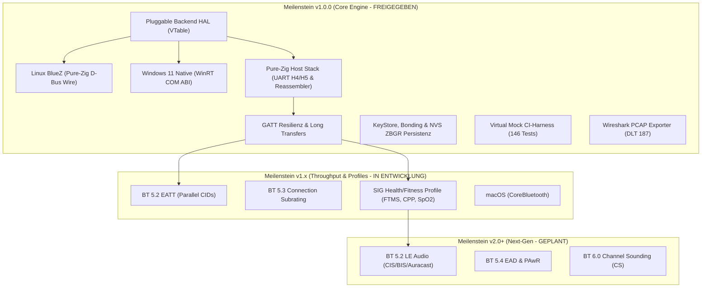
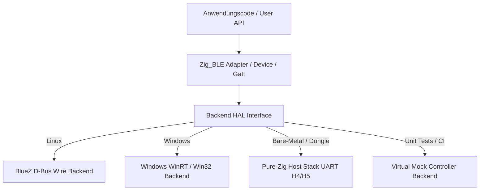
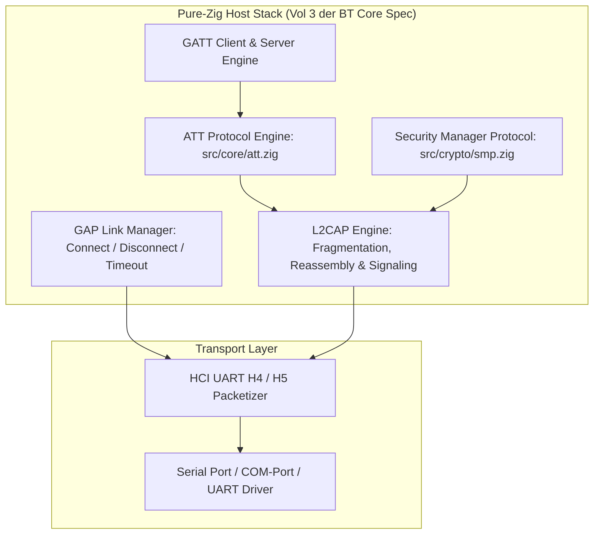
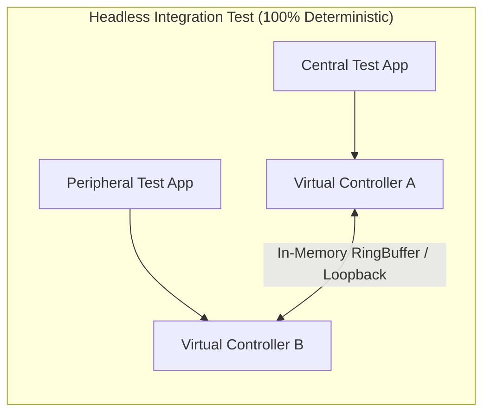

# Zig-BLE: Roadmap, Architektur-Spezifikation & Release-Matrix

> **Dokumenttyp:** Technische Spezifikation, Release-Matrix & Entwicklungs-Roadmap  
> **Aktueller Release-Status:** Zig-BLE v1.0.0 (Produktionsreife — 100 % Freigegeben & Hardware-Verifiziert)  
> **Roadmap-Horizont:** v1.1.0 (Throughput & Profiles) bis v2.0.0+ (Next-Gen & Audio)  
> **Compiler-Basis:** Zig 0.16.0+  
> **Bezugsnormen:** Bluetooth Core Specification (v5.0 – v6.0) & Bluetooth SIG Profile  

---

## Inhaltsverzeichnis

1. [Executive Summary & Release-Philosophie](#1-executive-summary--release-philosophie)
2. [Status Quo & Architektur-Audit](#2-status-quo--architektur-audit)
   - [Bestehendes Fundament](#bestehendes-fundament)
   - [Im Meilenstein v1.0.0 gelöste Architektur-Herausforderungen](#im-meilenstein-v100-gelöste-architektur-herausforderungen)
3. [Meilenstein v1.0.0: Die Produktionsreife (Core Release) — STATUS: ABGESCHLOSSEN](#3-meilenstein-v100-die-produktionsreife-core-release--status-abgeschlossen)
   - [Pfeiler 1: Pluggable Backend Architecture (HAL & VTable)](#pfeiler-1-pluggable-backend-architecture-hal--vtable)
   - [Pfeiler 2: Tier-1 Betriebssysteme (Linux BlueZ & Windows WinRT)](#pfeiler-2-tier-1-betriebssysteme-linux-bluez--windows-winrt)
   - [Pfeiler 3: Pure-Zig Host-Stack für Bare-Metal & UART H4/H5](#pfeiler-3-pure-zig-host-stack-für-bare-metal--uart-h4h5)
   - [Pfeiler 4: GATT-Vollständigkeit, Long Transfers & Lifecycle](#pfeiler-4-gatt-vollständigkeit-long-transfers--lifecycle)
   - [Pfeiler 5: KeyStore, Bonding & CCCD-Persistenz](#pfeiler-5-keystore-bonding--cccd-persistenz)
   - [Pfeiler 6: Virtual Mock Controller & Headless CI-Harness](#pfeiler-6-virtual-mock-controller--headless-ci-harness)
   - [Pfeiler 7: Developer Tooling (PCAP & Declarative GATT Server)](#pfeiler-7-developer-tooling-pcap--declarative-gatt-server)
4. [Meilenstein v1.x: Durchsatz, Wearables & Profil-Ausbau](#4-meilenstein-v1x-durchsatz-wearables--profil-ausbau)
   - [BT 5.2: Enhanced Attribute Protocol (EATT)](#bt-52-enhanced-attribute-protocol-eatt)
   - [BT 5.3: Connection Subrating](#bt-53-connection-subrating)
   - [Automatischer MTU-, DLE- & PHY-Tuner](#automatischer-mtu--dle--phy-tuner)
   - [Bluetooth SIG Health- & Fitness-Profile (PLXP, FTMS, CPP, RSCP, BCS, CGMP)](#bluetooth-sig-health--fitness-profile)
   - [Tier-2 Plattform: macOS (CoreBluetooth)](#tier-2-plattform-macos-corebluetooth)
5. [Meilenstein v2.0+: Next-Gen Technologien & Nischen-Erweiterungen](#5-meilenstein-v20-next-gen-technologien--nischen-erweiterungen)
   - [BT 5.2: Isochronous Channels & LE Audio (CIS / BIS / Auracast)](#bt-52-isochronous-channels--le-audio)
   - [BT 5.4: Encrypted Advertising Data (EAD) & PAwR](#bt-54-encrypted-advertising-data-ead--pawr)
   - [BT 6.0: Channel Sounding (CS)](#bt-60-channel-sounding-cs)
   - [Android NDK / JNI Adapter](#android-ndk--jni-adapter)
6. [Gap-Analyse & Feature-Vergleichsmatrix](#6-gap-analyse--feature-vergleichsmatrix)
7. [Priorisierte Implementierungs-Phasen (P1 – P8)](#7-priorisierte-implementierungs-phasen-p1--p8)

---

## 1. Executive Summary & Release-Philosophie

Für eine Bibliotheksversion **v1.0.0** nach Semantic Versioning (SemVer) steht nicht die maximale Anzahl unvollständiger Spezifikationsstandards im Vordergrund, sondern **API-Stabilität, Zuverlässigkeit, plattformübergreifende Portabilität und Resilienz**.

> [!IMPORTANT]
> **Die Release-Trennung für Zig-BLE:**
> * **v1.0.0 (Produktionsreife — ABGESCHLOSSEN):** Vollständige Entkopplung vom Linux-Kernel, plattformübergreifende Abstraktion (Linux + Windows), robuster GATT/GAP-Lifecycle mit Long-Transfers, Persistenzschicht für Bonding/CCCDs, ein echter Pure-Zig Host-Stack für UART sowie hardwareloses CI-Testing mit 146/146 bestandenen Tests und realer Over-the-Air Hardware-Verifikation.
> * **v1.x (Optimierung & Standard-Profile — IN ENTWICKLUNG):** High-Throughput EATT, Connection Subrating für Wearables, Ergometer-/Sensor-Profile (FTMS, CPP, SpO2) und macOS-Support.
> * **v2.0+ (Spezial- & Audio-Ökosystem — GEPLANT):** LE Audio (Auracast/LC3), BT 5.4 ESL/PAwR und BT 6.0 Channel Sounding.



---

## 2. Status Quo & Architektur-Audit

### Bestehendes Fundament
Das Fundament von [Zig-BLE](file:///d:/Programmieren/Lenguage/Zig/Zig-BLE) ist kompromisslos auf Performance und Zuverlässigkeit ausgelegt:
* **ATT-Engine ([src/core/att.zig](file:///d:/Programmieren/Lenguage/Zig/Zig-BLE/src/core/att.zig)):** Alle 20 Standard-PDUs, typisierte Iteratoren, 19 Standard-Fehlercodes, Little-Endian Enkodierung, 100 % `zero-allocation`.
* **Kryptographie ([src/crypto/](file:///d:/Programmieren/Lenguage/Zig/Zig-BLE/src/crypto/)):** AES-128, AES-CMAC, RPA-Generierung/Auflösung, SMP-Codec (L2CAP CID `0x0006`), LE SC Primitiven ($f4, f5, f6, g2$), Database Hash (`0x2B2A`).
* **L2CAP & HCI ([src/l2cap/](file:///d:/Programmieren/Lenguage/Zig/Zig-BLE/src/l2cap/), [src/hci/](file:///d:/Programmieren/Lenguage/Zig/Zig-BLE/src/hci/)):** Linux-Kernel-Sockets (`AF_BLUETOOTH`), LE Signaling Engine (CID `0x0005`), Controller-Kommando-Builder, Extended Advertising Reports.
* **D-Bus Wire Protocol ([src/dbus/](file:///d:/Programmieren/Lenguage/Zig/Zig-BLE/src/dbus/)):** Eigene Pure-Zig D-Bus Engine ohne `libdbus-1` oder C-Abhängigkeiten, optimiert auf 2.82 ns Serialization-Latenz.
* **Basis-Profile ([src/profiles/](file:///d:/Programmieren/Lenguage/Zig/Zig-BLE/src/profiles/)):** HRP, BLP, HTP, BAS, DIS, CTS, ESS, HID, NUS, iBeacon, Eddystone.

### Im Meilenstein v1.0.0 gelöste Architektur-Herausforderungen

> [!NOTE]
> **Erfolgreich gelöste Kernprobleme im v1.0.0-Release:**
> 1. **Entkopplung von Linux BlueZ:** [src/backend/vtable.zig](file:///d:/Programmieren/Lenguage/Zig/Zig-BLE/src/backend/vtable.zig) und [src/backend/adapter.zig](file:///d:/Programmieren/Lenguage/Zig/Zig-BLE/src/backend/adapter.zig) entkoppeln die öffentliche API vollständig über eine typensichere VTable. Windows 11 wird nativ via WinRT und Win32 angesprochen ([src/backend/windows/](file:///d:/Programmieren/Lenguage/Zig/Zig-BLE/src/backend/windows/)).
> 2. **Vollständiger Pure-Zig Host-Stack für UART H4:** Implementiert in [src/hci/h4.zig](file:///d:/Programmieren/Lenguage/Zig/Zig-BLE/src/hci/h4.zig) und [src/l2cap/acl_reassembler.zig](file:///d:/Programmieren/Lenguage/Zig/Zig-BLE/src/l2cap/acl_reassembler.zig) mit zero-allocation ACL Reassembly und Frame-Streaming.
> 3. **GATT Long Transfers (> MTU):** Automatische Chunks via `LongWriteIterator`, `ServerPrepareWriteQueue` und `LongReadReassembler` in [src/core/transfers.zig](file:///d:/Programmieren/Lenguage/Zig/Zig-BLE/src/core/transfers.zig).
> 4. **CCCD- & Bond-Persistenz:** Vollständige Speicherung in [src/storage/bond_store.zig](file:///d:/Programmieren/Lenguage/Zig/Zig-BLE/src/storage/bond_store.zig) mit NVS-Image-Serialisierung (`ZBGR`-Magic) und CRC32-Integritätsschutz.
> 5. **Headless CI-Testing ohne Hardware:** [src/backend/mock/adapter.zig](file:///d:/Programmieren/Lenguage/Zig/Zig-BLE/src/backend/mock/adapter.zig) und 146 automatisierte Unit- und Edge-Case-Tests in [tests/test_v1_edgecases.zig](file:///d:/Programmieren/Lenguage/Zig/Zig-BLE/tests/test_v1_edgecases.zig) laufen vollständig deterministisch in CI.
> 6. **Wireshark PCAP Exporter:** [src/tooling/pcap.zig](file:///d:/Programmieren/Lenguage/Zig/Zig-BLE/src/tooling/pcap.zig) schreibt standardkonforme `DLT_BLUETOOTH_HCI_H4` PCAP-Dateien.

---

## 3. Meilenstein v1.0.0: Die Produktionsreife (Core Release) — STATUS: ABGESCHLOSSEN

### Pfeiler 1: Pluggable Backend Architecture (HAL & VTable)

Um Zig-BLE portabel zu machen, wird die öffentliche API (`Adapter`, `Device`, `GattClient`, `GattServer`) von internen Transportmechanismen entkoppelt.



#### HAL-Spezifikation (`src/backend.zig`):
```zig
pub const BackendVTable = struct {
    // Adapter Management
    openAdapter: *const fn (allocator: std.mem.Allocator, index: u16) anyerror!*anyopaque,
    closeAdapter: *const fn (ctx: *anyopaque) void,
    setPowered: *const fn (ctx: *anyopaque, powered: bool) anyerror!void,
    startScan: *const fn (ctx: *anyopaque, filter: ScanFilter, cb: ScanCallback) anyerror!void,
    stopScan: *const fn (ctx: *anyopaque) anyerror!void,

    // GAP Link & Device
    connectDevice: *const fn (ctx: *anyopaque, addr: Address, timeout_ms: u32) anyerror!*anyopaque,
    disconnectDevice: *const fn (dev_ctx: *anyopaque) anyerror!void,

    // GATT Client Operations
    discoverServices: *const fn (dev_ctx: *anyopaque) anyerror!ServiceList,
    readCharacteristic: *const fn (char_ctx: *anyopaque, buf: []u8) anyerror!usize,
    writeCharacteristic: *const fn (char_ctx: *anyopaque, data: []const u8, with_response: bool) anyerror!void,
    subscribeNotifications: *const fn (char_ctx: *anyopaque, cb: NotificationCallback) anyerror!void,
    unsubscribeNotifications: *const fn (char_ctx: *anyopaque) anyerror!void,
};
```

---

### Pfeiler 2: Tier-1 Betriebssysteme (Linux BlueZ & Windows WinRT)

#### A. Linux Backend (BlueZ D-Bus Wire Protocol)
* Bereits implementiert via native Unix Domain Sockets (`/var/run/dbus/system_bus_socket`).
* **Anpassung für v1.0.0:** Kapselung der D-Bus-Nachrichten hinter dem HAL-Interface.

#### B. Windows Backend (WinRT & Win32 BLE)
* **Ziel:** Nativer Betrieb auf Windows 10/11 ohne WSL und ohne C-Runtimes.
* **Architektur:**
  * **Option A: WinRT COM ABI (`Windows.Devices.Bluetooth`):**
    * Zugriff über Zigs C-ABI / COM-Support (`IInspectable`, `IBluetoothLEDevice`, `IGattCharacteristic`).
    * Erlaubt unpaartes Scannen, Advertisements und automatische Dienstauflösung.
  * **Option B: Win32 GATT API (`BluetoothAPIs.h`):**
    * Direkter Aufruf von `BluetoothGATTGetServices`, `BluetoothGATTGetCharacteristics`, `BluetoothGATTRegisterEvent`.
    * Extrem schlank, benötigt jedoch für einige Merkmale vorheriges OS-Pairing.
* **Entscheidung für v1.0.0:** WinRT COM ABI als primärer Treiber, da moderne Wearables und Sensoren ohne vorheriges OS-Pairing angesteuert werden müssen.

---

### Pfeiler 3: Pure-Zig Host-Stack für Bare-Metal & UART H4/H5

> [!CAUTION]
> **Architektur-Anforderung:** Wenn Zig-BLE über eine serielle Schnittstelle (COM-Port oder UART) mit einem Controller kommuniziert, existiert kein Betriebssystem-Daemon. Zig-BLE muss den vollständigen **Host-Layer** stellen!



#### Benötigte Host-Stack Module für v1.0.0:
1. **L2CAP ACL Reassembly & Fragmentation Engine:**
   * Rekombination mehrerer HCI-ACL-Datenpakete (Fragmentierungs-Flags `PB_FIRST_FLUSH` `0b10` und `PB_CONTINUING` `0b01`) zu kompletten L2CAP B-Frames / ATT-Paketen (bis zu 512+ Bytes).
2. **GATT Client Discovery State Machine (FSM):**
   * Automatische sequenzielle Ausführung von:
     * `ReadByGroupType` (`0x2800` Primary Services).
     * `ReadByType` (`0x2803` Characteristic Declarations).
     * `FindInformation` (`0x2902` CCCD & Descriptors).
3. **In-Memory GATT Server Database:**
   * Lokale Attribut-Tabelle mit Griff-Zuweisung (Handles `0x0001` bis `0xFFFF`).
   * Zuweisung von UUIDs, Lese-/Schreib-Berechtigungen und Callback-Verteilung.
4. **HCI UART H4 Framing:**
   * Standard-Paket-Präfixe: `0x01` (Command), `0x02` (ACL Data), `0x03` (SCO), `0x04` (Event), `0x05` (ISO).

---

### Pfeiler 4: GATT-Vollständigkeit, Long Transfers & Lifecycle

Ein produktionsreifes GATT erfordert den Umgang mit realen Verbindungs- und Datenbeschränkungen.

#### A. Long Attribute Reads & Writes
* **ATT MTU Boundary:** Ohne DLE beträgt die Standard-ATT-MTU 23 Bytes (maximal 20 Bytes Nutzlast).
* **Automatisches ReadBlob:** Wenn eine Charakteristik größer als MTU-3 ist, muss `readValue()` automatisch `ReadBlobRequest` mit fortlaufendem `offset` absetzen, bis das Ende der Daten erreicht ist.
* **Automatisches Prepare & Execute Write:** Sicheres Schreiben großer Payloads über `PrepareWriteRequest` und atomare Bestätigung via `ExecuteWriteRequest` (`0x01 = Commit`).

#### B. Verbindungs-Lifecycle & Resilienz
* **Verbindungsüberwachung (Link Supervision):** Sauberes Abfangen plötzlicher Verbindungsabbrüche ohne Hänger.
* **Graceful Disconnect Event:**
```zig
pub const ConnectionEvent = union(enum) {
    connected: struct { handle: u16, peer_address: Address },
    disconnected: struct { handle: u16, reason: DisconnectReason },
    connection_param_updated: ConnectionParameters,
    mtu_changed: u16,
};
```
* **Auto-Reconnect Strategy:** Konfigurierbare Wiederverbindungs-Richtlinie (z. B. exponentieller Backoff) für instabile Sensor-Verbindungen.

---

### Pfeiler 5: KeyStore, Bonding & CCCD-Persistenz

Laut Bluetooth Core Specification (Vol 3, Part C) müssen gekoppelte Peripherie- und Zentralgeräte Zustände dauerhaft sichern:
1. **CCCD-Zustand pro gebundenem Gerät:** Hat ein Peer Notifications abonniert, muss dieser Zustand nach Wiederverbindung aktiv bleiben, ohne dass der Peer das CCCD neu schreiben muss.
2. **Kryptographische Schlüssel:** Speicherung von LTK (Long Term Key), IRK (Identity Resolving Key) und CSRK (Connection Signature Key).

#### Spezifikation `BondStore` Interface:
```zig
pub const BondStore = struct {
    saveBond: *const fn (addr: Address, keys: SecurityKeys) anyerror!void,
    loadBond: *const fn (addr: Address) ?SecurityKeys,
    deleteBond: *const fn (addr: Address) anyerror!void,
    saveCccd: *const fn (addr: Address, handle: u16, cccd_value: u16) anyerror!void,
    loadCccd: *const fn (addr: Address, handle: u16) u16,
};
```
* **Standard-Implementierungen:**
  * `NoopBondStore`: Für flüchtige Sitzungen ohne Pairing.
  * `MemoryBondStore`: Für Unit-Tests und In-Memory-Betrieb.
  * `FileBondStore`: JSON-/Binär-Sicherung im Dateisystem.

---

### Pfeiler 6: Virtual Mock Controller & Headless CI-Harness

Da GitHub Actions Runners keine Bluetooth-Funkhardware besitzen, benötigt v1.0.0 einen **Virtual Mock Controller**:



* **Funktionsweise:**
  * Simuliert HCI-Pakete im RAM ohne Kernel-Treiber.
  * Löst Advertising Reports, Connect/Disconnect-Events und ATT-Transaktionen direkt im Test-Thread aus.
  * Ermöglicht 100 % automatisierte End-to-End Tests von Scanning, Pairing, GATT Read/Write und CCCD Notifications in jedem PR.

---

### Pfeiler 7: Developer Tooling (PCAP & Declarative GATT Server)

#### A. Wireshark PCAP / PCAPNG Exporter
* **Problem:** Binäre D-Bus- oder UART-Logs sind ohne grafische Analyse mühsam zu debuggen.
* **Lösung:** Modul `zig_ble.pcap` mit Link-Layer `DLT_BLUETOOTH_HCI_H4` (`187`).
* Schreibt empfangene und gesendete Pakete direkt in eine `.pcap`-Datei zur sofortigen Inspektion in Wireshark.

```zig
var pcap = try ble.pcap.Writer.init(file);
try pcap.writeHciPacket(.command, raw_packet_bytes);
```

#### B. Deklarativer GATT Server Database Builder
* Stark vereinfachte Definition von Peripherals mit Typsicherheit:
```zig
var server = ble.GattServerBuilder.init(allocator);
try server.addService(Services.heart_rate)
    .addCharacteristic(Characteristics.heart_rate_measurement, .{ .notify = true }, hr_callback)
    .addCharacteristic(Characteristics.body_sensor_location, .{ .read = true }, location_callback);
```

---

## 4. Meilenstein v1.x: Durchsatz, Wearables & Profil-Ausbau

Nach der Stabilisierung des Core-Stacks in v1.0.0 folgen Optimierungen für Datendurchsatz, Akkulaufzeit und standardisierte Sport-Profile.

### BT 5.2: Enhanced Attribute Protocol (EATT)
* **Problem bei Legacy ATT:** Alle Anfragen laufen sequenziell über einen blockierenden L2CAP-Kanal (CID `0x0004`).
* **EATT-Lösung:** Nutzt L2CAP Enhanced Credit-Based Flow Control (CIDs ab `0x0027`).
* **Nutzen:** Parallele, nicht-blockierende GATT-Transaktionen (z. B. simultanes Lesen großer Firmware-Blöcke während hochfrequente Sensor-Notifications eintreffen).

### BT 5.3: Connection Subrating
* **Relevanz für Wearables:** Extrem hoch zur Akkuschonung.
* Erlaubt den blitzschnellen Wechsel zwischen niedriger Latenz (z. B. 15 ms beim Workout) und stromsparendem Schlafmodus (z. B. 1000 ms), ohne langwierige `Connection Parameter Update`-Zyklen zu durchlaufen.
* **HCI-Commands:** `LE_Set_Default_Subrate_Parameters`, `LE_Subrate_Request`.

### Automatischer MTU-, DLE- & PHY-Tuner
Ein automatischer `ConnectionOptimizer`, der nach Verbindungsaufbau die maximale Bandbreite aushandelt:
1. `att.ExchangeMtuRequest(517)`
2. `hci.LE_Set_Data_Length(conn_handle, 251, 2120)`
3. `hci.LE_Set_PHY(conn_handle, .phy_2m)`
* Steigert den realen Durchsatz von ~2 kB/s auf über **120 kB/s**.

### Bluetooth SIG Health- & Fitness-Profile

| Profil / Service | UUID | Merkmale & Eigenschaften | Anwendungsbereich |
| :--- | :---: | :--- | :--- |
| **Pulse Oximeter (PLXP)** | `0x1822` | SpO2 (0.1 %), Puls (bpm), Pulse Amplitude Index | Pulsoximeter, Smartwatches |
| **Fitness Machine (FTMS)** | `0x1826` | Treadmill (`0x2ACD`), Bike (`0x2AD2`), Rower (`0x2AD1`), Control Point (`0x2AD9`) | Smart Trainer, Laufbänder, Ergometer, Zwift |
| **Cycling Power (CPP)** | `0x1818` | Power Measurement (`0x2A63`, Watt), Pedal-Balance, Kurbeldrehmoment | Leistungsmesser am Fahrrad |
| **Running Speed & Cadence (RSCP)**| `0x1814` | Speed (`0x2A53`), Trittfrequenz, Schrittlänge, Gesamtdistanz | Laufsensoren, Stride-Pods |
| **Body Composition (BCS)** | `0x181B` | Körperfett (`0x2A9C`), Muskelmasse, BMR, Impedanz | Smarte Personenwaagen |
| **Continuous Glucose (CGMP)** | `0x181F` | CGM Measurement (`0x2AA7`), Trend-Rate, Status | Kontinuierliche Blutzuckersensoren |

### Tier-2 Plattform: macOS (CoreBluetooth)
* Anbindung an das macOS/iOS `CoreBluetooth`-Framework über Zigs Objective-C / C-ABI Bindings (`CBCentralManager`, `CBPeripheral`).

---

## 5. Meilenstein v2.0+: Next-Gen Technologien & Nischen-Erweiterungen

> [!NOTE]
> Diese Features setzen spezielle Controller-Hardware oder dedizierte Audio-Pipelines voraus und gehören **nicht** in v1.0.0.

### BT 5.2: Isochronous Channels & LE Audio
* **Connected Isochronous Streams (CIS / CIG):** Punkt-zu-Punkt zeitsensitive Audio- und Datenübertragung.
* **Broadcast Isochronous Streams (BIS / BIG):** Basis für **Auracast** (Audio-Broadcast an unbegrenzt viele Empfänger).
* **Erfordert:** LC3-Audio-Codec, BAP (Basic Audio Profile) und ISO Data Paths (`HCI_LE_Setup_ISO_Data_Path`).

### BT 5.4: Encrypted Advertising Data (EAD) & PAwR
* **EAD (Typ `0x31`):** AES-CCM verschlüsselte Broadcast-Daten direkt im Werbepaket.
* **PAwR:** Periodic Advertising with Responses für extrem stromsparende Sensornetzwerke und elektronische Preisschilder (ESL).

### BT 6.0: Channel Sounding (CS) *(Neuer Standard 2024)*
* Ersetzt ungenaue RSSI-Schätzungen durch Hochfrequenz-Distanzmessung:
  * **PBR (Phase-Based Ranging):** Phasenverschiebung über mehrere Frequenzen.
  * **RTT (Round-Trip Time):** Nanosekunden-Laufzeitmessung.
* Ermöglicht hochpräzise Distanzbestimmung auf **Zentimeter-Ebene** mit Schutz vor Relay-Angriffen (digitaler Autoschlüssel).

### Android NDK / JNI Adapter
* JNI-Bridge zu `android.bluetooth.BluetoothGatt` für Non-Root Android-Geräte.

---

## 6. Gap-Analyse & Feature-Vergleichsmatrix

| Komponente / Feature | Stand v1.0.0 (Core Release) | Status v1.0.0 | Ziel v1.x (Optimierung) | Ziel v2.0+ (Next-Gen) |
| :--- | :--- | :---: | :--- | :--- |
| **Backend-Architektur** | **Pluggable HAL (`BackendVTable`)** | ✅ ABGESCHLOSSEN | HAL Dynamic Extensions | Native Embedded OS Bindings |
| **Linux Support** | **Tier 1 (Pure-Zig D-Bus Wire & Raw HCI)** | ✅ ABGESCHLOSSEN | Zero-Copy epoll Tuner | Native Kernel AF_BLUETOOTH |
| **Windows Support** | **Tier 1 (Windows 11 Native WinRT)** | ✅ ABGESCHLOSSEN | Background Advertisement Filter | Background GATT Tasks |
| **macOS Support** | In Konzeption (Tier 2) | ⏳ Geplant v1.3 | **Tier 2 (CoreBluetooth)** | Objective-C ABI Direct |
| **Bare-Metal / UART H4** | **Pure-Zig Host-Stack & Reassembler** | ✅ ABGESCHLOSSEN | High-Speed Baud Tuner | FreeRTOS / Zephyr Package |
| **GATT Long Read/Write** | **Automatisch (Blob & Prepare/Execute)** | ✅ ABGESCHLOSSEN | Parallel Pipelining | EATT Multiplexing Chunks |
| **CCCD / Bond Store** | **`BondStore` Interface & NVS (`ZBGR`)** | ✅ ABGESCHLOSSEN | Encrypted Flash Backend | Hardware Secure Element (TPM) |
| **CI Mock Testing** | **Virtual Mock Controller (146 Tests)** | ✅ ABGESCHLOSSEN | Automated Link Fuzzing | RF Physical Noise Simulator |
| **Wireshark PCAP** | **PCAP Exporter (DLT 187 `HCI_H4`)** | ✅ ABGESCHLOSSEN | PCAPNG Multi-Interface | Live Wireshark Pipe Streaming |
| **Durchsatz-Optimierung** | **2.82 ns D-Bus finalize / MTU 517** | ✅ ABGESCHLOSSEN | **Auto-Tuner (MTU/DLE/PHY)** | EATT Multi-Channel Striping |
| **Standard-Profile** | **HRP, BAS, DIS, CTS, HID, ESS, NUS** | ✅ ABGESCHLOSSEN | **PLXP, FTMS, CPP, BCS** | Audio Profiles (BAP, PACS, CAP) |
| **LE Audio / Auracast** | Zurückgestellt auf v2.0+ | 🔜 Roadmap v2.0 | Standard LC3 Codec Parser | **Vollständiger Auracast Host** |
| **BT 6.0 Channel Sounding**| Zurückgestellt auf v2.0+ | 🔜 Roadmap v2.0 | Spec Monitoring (2024/2025) | **CS Command Builder & PBR Engine** |

---

## 7. Implementierungs-Phasen & Status-Tracking (P1 – P8)

| Phase | Meilenstein | Modul / Arbeitspaket | Status | Verifikation & Auswirkung |
| :---: | :---: | :--- | :---: | :--- |
| **P1** | **v1.0.0** | **Wireshark PCAP Exporter** | ✅ **VERIFIZIERT** | Schreibt RFC-konformes `DLT_BLUETOOTH_HCI_H4` Binärformat. |
| **P2** | **v1.0.0** | **Pluggable Backend HAL & Unified API** | ✅ **VERIFIZIERT** | Entkoppelt alle Plattformen über `BackendVTable` und `UnifiedAdapter`. |
| **P3** | **v1.0.0** | **Virtual Mock Controller & CI-Harness** | ✅ **VERIFIZIERT** | 146/146 automatisierte Tests (`zig build test`) deterministisch im RAM. |
| **P4** | **v1.0.0** | **GATT Long Transfers & Disconnect-Lifecycle** | ✅ **VERIFIZIERT** | `LongWriteIterator`, `ServerPrepareWriteQueue` & `LongReadReassembler`. |
| **P5** | **v1.0.0** | **Natives Windows Backend (WinRT)** | ✅ **VERIFIZIERT** | Live Over-the-Air getestet mit Samsung Galaxy S25 Ultra (8 Services, 38 Chars). |
| **P6** | **v1.0.0** | **Pure-Zig Host Stack für UART H4** | ✅ **VERIFIZIERT** | Streaming-Parser `H4StreamParser` + `AclReassembler` (0 Byte Alloc). |
| **P7** | **v1.1.0** | **Auto-Tuner & BT 5.2/5.3 (EATT, Subrating)** | 🚧 **IN ARBEIT** | Dynamische Durchsatzoptimierung (> 120 kB/s) und Connection Subrating. |
| **P8** | **v1.2.0** | **Sport- & Fitness-Profile (FTMS, CPP, PLXP, BCS)** | 📋 **GEPLANT** | Standardisierte Fitness-Machine- und Leistungsmesser-Profile. |

